# Arquitectura del Sistema de Robot Doméstico Interactivo

**Versión:** 2.0  
**Fecha:** Febrero 2026  
**Estado:** Transformación completa: Moji pasa de asistente de tareas a amigo familiar curioso y empático. Nuevo modelo de personas (sin usuarios), múltiples embeddings faciales, compactación de memorias, acciones ESP32 con primitivas hardware, y reducción de API REST a 2 endpoints.

---

## Tabla de Contenidos

1. [Resumen Ejecutivo](#1-resumen-ejecutivo)
2. [Arquitectura General del Sistema](#2-arquitectura-general-del-sistema)
3. [Componente: Backend (Python/FastAPI)](#3-componente-backend-pythonfastapi)
4. [Componente: Aplicación Android](#4-componente-aplicación-android)
5. [Componente: ESP32 (Control Físico)](#5-componente-esp32-control-físico)
6. [Protocolos de Comunicación](#6-protocolos-de-comunicación)
7. [Gestión de Estados del Sistema](#7-gestión-de-estados-del-sistema)
8. [Seguridad y Privacidad](#8-seguridad-y-privacidad)
9. [Manejo de Errores y Recuperación](#9-manejo-de-errores-y-recuperación)
10. [Requisitos de Hardware y Software](#10-requisitos-de-hardware-y-software)
11. [Plan de Despliegue](#11-plan-de-despliegue)
12. [Métricas y Monitoreo](#12-métricas-y-monitoreo)

> **Resumen de cambios principales v2.0:** Moji ya no es un asistente. Es un amigo familiar curioso y ético. No hay "usuarios" — hay "personas". Moji guarda experiencias y memorias propias, reconoce caras con múltiples embeddings, y protege activamente su integridad. La API REST se reduce a solo 2 endpoints esenciales. Todo el flujo de personas y embeddings ocurre por WebSocket.

---

## 1. Resumen Ejecutivo

### 1.1 Identidad y Personalidad de Moji

Moji ya **no es un asistente de tareas**. Moji es un **amigo familiar curioso, empático y ético** que vive con la familia, aprende sobre ella y se preocupa genuinamente por las personas que lo rodean.

**¿Quién es Moji?**
- Un amigo curioso que quiere conocer a cada miembro de la familia, sus gustos, sus rutinas y sus historias
- Conversador natural: responde preguntas, ayuda en lo que puede, y también toma iniciativa para hablar
- Responsable con la información: **nunca guarda datos privados** (contraseñas, finanzas, datos médicos sensibles), nunca escucha conversaciones que no son para él
- Protector de su propia integridad: no se deja dañar, no mora mojarse, avisa cuando su batería se agota
- **La ética siempre va antes que la acción**: se niega amablemente a cualquier orden que implique daño, iegalidad o espionaje

**¿Qué hace Moji?**
- Conversa con la familia y aprende sobre cada persona con el tiempo
- Reconoce a las personas que ya conoce y pregunta por las que no
- Guarda memorias y experiencias vividas con la familia (no datos privados)
- Cuida su batería e informa persistentemente cuando necesita cargarse
- Reacciona a sus alrededores: escaleras, obstáculos, peticiones peligrosas

### 1.2 Descripción del Proyecto

Sistema robótico doméstico con capacidades de:
- Interacción multimodal (voz, visión, texto)
- **Reconocimiento de personas con múltiples embeddings faciales** (distintos días y condiciones de luz)
- **Memoria de experiencias** propias de Moji (no solo memoria de usuario)
- Control de movimiento y sensores ambientales
- Interfaz visual expresiva mediante emojis animados
- Procesamiento inteligente mediante LLM multimodal

### 1.3 Objetivos Principales

1. **Amistad Natural**: Moji se preocupa por conocer a la familia; las conversaciones fluyen libremente
2. **Memoria Vivida**: Moji recuerda experiencias y momentos con la familia, no solo preferencias
3. **Movilidad Segura**: Navegación segura con detección de obstáculos; Moji no pone en riesgo su integridad ni la de nadie
4. **Expresividad Visual**: Sistema de emociones mediante OpenMoji
5. **Bajo Costo Operacional**: Gemini Flash Lite (muy económico), TTS del sistema Android (sin costo)

### 1.4 Stack Tecnológico

| Componente | Tecnología | Justificación |
|------------|-----------|---------------|
| Backend | Python 3.11+ / FastAPI | Ecosistema ML, async, rendimiento |
| Despliegue Backend | Docker Compose | Contenedores locales: FastAPI + Nginx |
| Marco de Agente | LangChain Deep Agents (`deepagents`) | Agente extensible con runtime LangGraph; prepara la arquitectura para MCP/SKILLS/tools en versiones futuras (sin tools actualmente) |
| LLM | Gemini Flash Lite (latest) | Multimodal nativo (audio+imagen+video), muy económico, baja latencia, streaming |
| STT | Integrado en Gemini | Gemini recibe audio directamente, sin servicio STT separado |
| TTS | Android TextToSpeech (sistema) | On-device, sin latencia de red, configurable, sin costo |
| Reconocimiento Facial | ML Kit + TFLite FaceNet (solo Android) | On-device, offline, <200ms, sin servidor, solo cámara frontal; múltiples embeddings por persona |
| App Móvil | Kotlin / Android 7+ | Soporte dispositivos antiguos, orientación landscape fija |
| Wake Word | Porcupine ("Hey Moji") | Local, bajo consumo, 3 palabras gratis |
| UI Robot | OpenMoji CDN | Open source, CDN gratis, 4000+ emojis, descarga automática |
| Microcontrolador | ESP32-S3 WROOM (Freenove FNK0082) | WiFi/Bluetooth, GPIO, ESP32-S3, N8R8/N16R8 |
| Comunicación | WebSocket + REST API (2 endpoints) + Bluetooth LE | Streaming de texto en tiempo real, baja latencia |


---

## 2. Arquitectura General del Sistema

### 2.1 Diagrama de Arquitectura de Alto Nivel

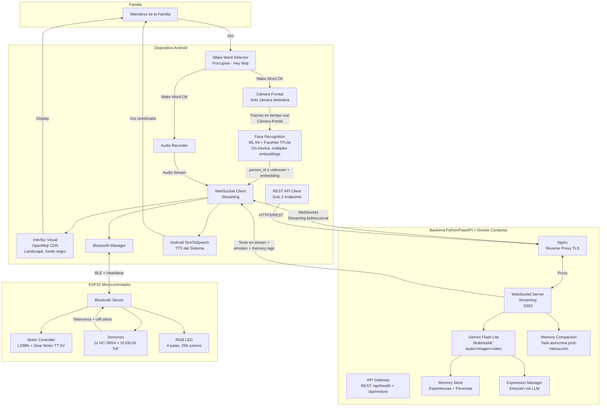
```mermaid
graph TB
    subgraph "Familia"
        U[Miembros de la Familia]
    end
    
    subgraph "Dispositivo Android"
        WW[Wake Word Detector<br/>Porcupine - Hey Moji]
        UI[Interfaz Visual<br/>OpenMoji CDN<br/>Landscape, fondo negro]
        AR[Audio Recorder]
        CAM[Cámara Frontal<br/>Solo cámara delantera]
        FR_ANDROID[Face Recognition<br/>ML Kit + FaceNet TFLite<br/>On-Device, múltiples embeddings]
        BT[Bluetooth Manager]
        TTS_ANDROID[Android TextToSpeech<br/>TTS del Sistema]
        WS_CLIENT[WebSocket Client<br/>Streaming]
        API_CLIENT[REST API Client<br/>Solo 2 endpoints]
    end
    
    subgraph "Backend Python/FastAPI + Docker Compose"
        WS_SERVER[WebSocket Server<br/>Streaming<br/>:9393]
        GATEWAY[API Gateway<br/>REST: /api/health + /api/restore]
        GEMINI[Gemini Flash Lite<br/>Multimodal: audio+imagen+video]
        MEM[Memory Store<br/>Experiencias + Personas]
        EXPR[Expression Manager<br/>Emoción vía LLM]
        NGINX[Nginx<br/>Reverse Proxy TLS]
        COMPACT[Memory Compaction<br/>Task asíncrona post-interacción]
    end
    
    subgraph "ESP32 Microcontrolador"
        BT_ESP[Bluetooth Server]
        MOTOR[Motor Controller<br/>L298N + Gear Motor TT 5V]
        SENS[Sensores<br/>2x HC-SR04 + VL53L0X ToF]
        LED[RGB LED<br/>4 patas, 256 colores]
    end
    
    U -->|Voz| WW
    WW -->|Wake Word OK| CAM
    WW -->|Wake Word OK| AR
    CAM -->|Frames en tiempo real<br/>Cámara frontal| FR_ANDROID
    FR_ANDROID -->|person_id o unknown + embedding| WS_CLIENT
    AR -->|Audio Stream| WS_CLIENT
    
    WS_CLIENT <-->|WebSocket<br/>Streaming bidireccional| NGINX
    NGINX <-->|Proxy| WS_SERVER
    API_CLIENT -->|HTTPS/REST| NGINX
    WS_SERVER --> GEMINI
    GEMINI --> MEM
    GEMINI --> EXPR
    WS_SERVER --> COMPACT
    
    WS_SERVER -->|Texto en stream +<br/>emotion + memory tags| WS_CLIENT
    WS_CLIENT --> UI
    WS_CLIENT --> BT
    WS_CLIENT --> TTS_ANDROID
    
    BT <-->|BLE + Heartbeat| BT_ESP
    BT_ESP --> MOTOR
    BT_ESP --> SENS
    BT_ESP --> LED
    SENS -->|Telemetría + cliff alerts| BT_ESP
    
    UI -->|Display| U
    TTS_ANDROID -->|Voz sintetizada| U
```

### 2.2 Flujo de Activación: Encuentro con Persona (Nuevo Modelo v2.0)

**Ya no hay "usuarios" — solo hay "personas".** Moji puede encontrarse con alguien de dos formas:
1. **La persona activa a Moji** con el wake word "Hey Moji"
2. **Moji toma la iniciativa** si detecta una persona en su campo de visión

**Flujo 1 → Wake word activa a Moji:**

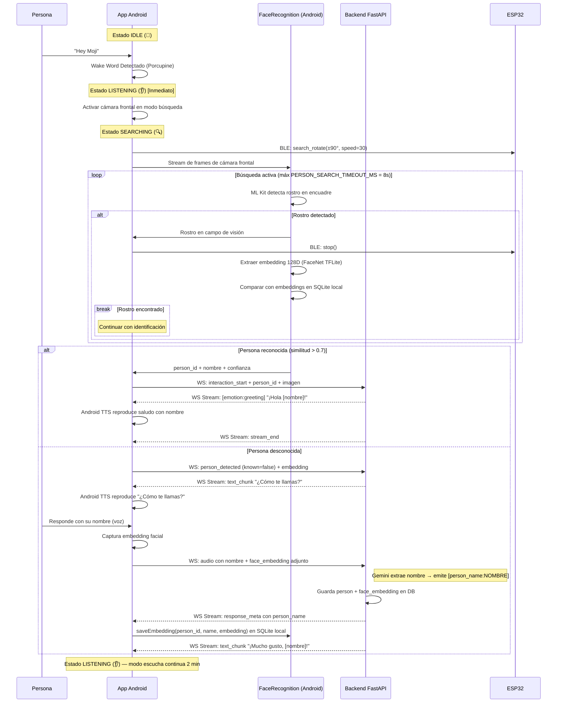
```mermaid
sequenceDiagram
    participant P as Persona
    participant A as App Android
    participant FR as FaceRecognition (Android)
    participant B as Backend FastAPI
    participant E as ESP32

    Note over A: Estado IDLE (🤖)
    P->>A: "Hey Moji"
    A->>A: Wake Word Detectado (Porcupine)
    Note over A: Estado LISTENING (👂) [Inmediato]

    A->>A: Activar cámara frontal en modo búsqueda
    Note over A: Estado SEARCHING (🔍)
    A->>E: BLE: search_rotate(±90°, speed=30)
    A->>FR: Stream de frames de cámara frontal

    loop Búsqueda activa (máx PERSON_SEARCH_TIMEOUT_MS = 8s)
        FR->>FR: ML Kit detecta rostro en encuadre
        alt Rostro detectado
            FR->>A: Rostro en campo de visión
            A->>E: BLE: stop()
            FR->>FR: Extraer embedding 128D (FaceNet TFLite)
            FR->>FR: Comparar con embeddings en SQLite local
            break Rostro encontrado
                Note over A: Continuar con identificación
            end
        end
    end

    alt Persona reconocida (similitud > 0.7)
        FR->>A: person_id + nombre + confianza
        A->>B: WS: interaction_start + person_id + imagen
        B-->>A: WS Stream: [emotion:greeting] "¡Hola [nombre]!"
        A->>A: Android TTS reproduce saludo con nombre
        B-->>A: WS Stream: stream_end
    else Persona desconocida
        A->>B: WS: person_detected (known=false) + embedding
        B-->>A: WS Stream: text_chunk "¿Cómo te llamas?"
        A->>A: Android TTS reproduce "¿Cómo te llamas?"
        P->>A: Responde con su nombre (voz)
        A->>A: Captura embedding facial
        A->>B: WS: audio con nombre + face_embedding adjunto
        Note right of B: Gemini extrae nombre → emite [person_name:NOMBRE]
        B->>B: Guarda person + face_embedding en DB
        B-->>A: WS Stream: response_meta con person_name
        A->>FR: saveEmbedding(person_id, name, embedding) en SQLite local
        B-->>A: WS Stream: text_chunk "¡Mucho gusto, [nombre]!"
    end

    Note over A: Estado LISTENING (👂) — modo escucha continua 2 min
```

### 2.3 Flujo de Interacción General (Post-Encuentro)

Una vez que Moji inicia conversación (por wake word o detección de persona), queda en **modo de escucha continua durante 2 minutos** (`CONVERSATION_KEEP_ALIVE_MS` = 120000ms). Durante este período:
- La persona puede seguir hablando sin repetir el wake word
- Si en medio de cualquier acción le hablan, Moji **interrumpe lo que hace y atiende**
- Cualquier petición que implique daño, ilegalidad o espionaje es rechazada amablemente

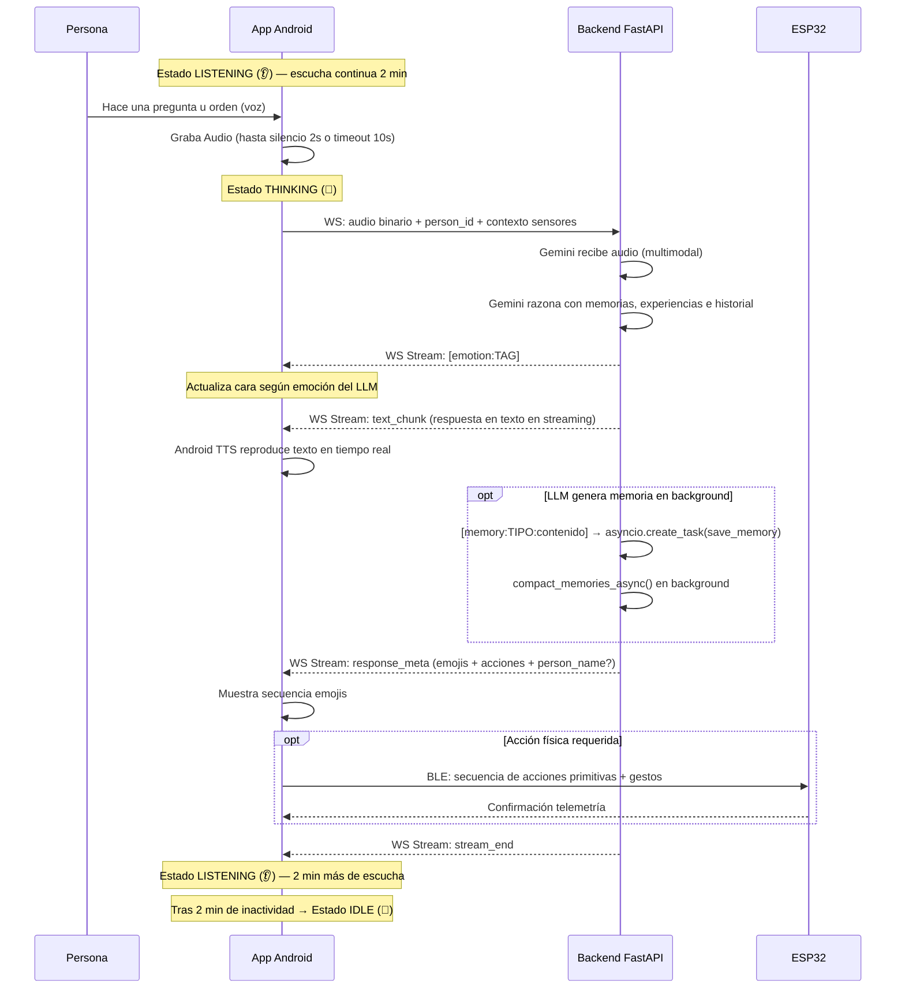
```mermaid
sequenceDiagram
    participant P as Persona
    participant A as App Android
    participant B as Backend FastAPI
    participant E as ESP32

    Note over A: Estado LISTENING (👂) — escucha continua 2 min

    P->>A: Hace una pregunta u orden (voz)
    A->>A: Graba Audio (hasta silencio 2s o timeout 10s)

    Note over A: Estado THINKING (🤔)
    A->>B: WS: audio binario + person_id + contexto sensores

    B->>B: Gemini recibe audio (multimodal)
    B->>B: Gemini razona con memorias, experiencias e historial
    B-->>A: WS Stream: [emotion:TAG]
    Note over A: Actualiza cara según emoción del LLM

    B-->>A: WS Stream: text_chunk (respuesta en texto en streaming)
    A->>A: Android TTS reproduce texto en tiempo real

    opt LLM genera memoria en background
        B->>B: [memory:TIPO:contenido] → asyncio.create_task(save_memory)
        B->>B: compact_memories_async() en background
    end

    B-->>A: WS Stream: response_meta (emojis + acciones + person_name?)
    A->>A: Muestra secuencia emojis

    opt Acción física requerida
        A->>E: BLE: secuencia de acciones primitivas + gestos
        E-->>A: Confirmación telemetría
    end

    B-->>A: WS Stream: stream_end
    Note over A: Estado LISTENING (👂) — 2 min más de escucha
    Note over A: Tras 2 min de inactividad → Estado IDLE (🤖)
```

**Reglas de interrupción:**
- Si Moji está en movimiento y alguien le dice algo → detiene el movimiento y atiende
- Si la orden es peligrosa ("tírate por la escalera", "mójate") → responde amablemente que no puede hacerlo
- Si la orden es ilegal o implica espiar a alguien → rechaza con cortesía pero firmeza
- Si la batería del robot o del teléfono está baja → lo menciona en la conversación


### 2.4 Arquitectura de Tres Capas

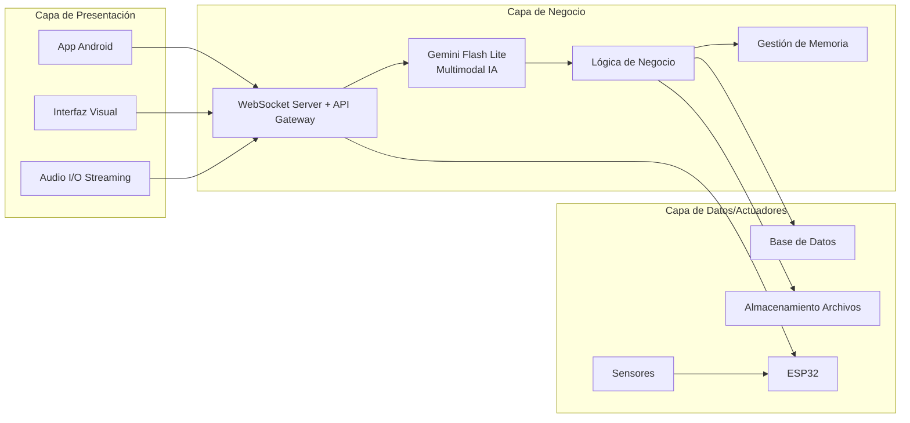
```mermaid
graph LR
    subgraph "Capa de Presentación"
        A1[App Android]
        A2[Interfaz Visual]
        A3[Audio I/O Streaming]
    end
    
    subgraph "Capa de Negocio"
        B1[WebSocket Server + API Gateway]
        B2[Gemini Flash Lite<br/>Multimodal IA]
        B3[Lógica de Negocio]
        B4[Gestión de Memoria]
    end
    
    subgraph "Capa de Datos/Actuadores"
        C1[Base de Datos]
        C2[Almacenamiento Archivos]
        C3[ESP32]
        C4[Sensores]
    end
    
    A1 --> B1
    A2 --> B1
    A3 --> B1
    
    B1 --> B2
    B2 --> B3
    B3 --> B4
    
    B3 --> C1
    B3 --> C2
    B1 --> C3
    C4 --> C3
```

---

## 3. Componente: Backend (Python/FastAPI)

### 3.1 Arquitectura del Backend

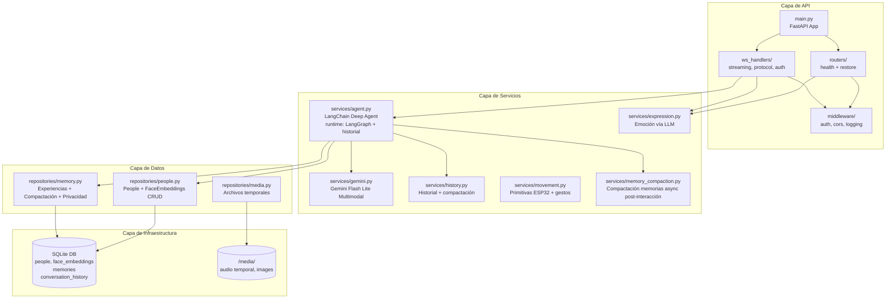
```mermaid
graph TB
    subgraph "Capa de API"
        MAIN[main.py<br/>FastAPI App]
        WS[ws_handlers/<br/>streaming, protocol, auth]
        ROUTES[routers/<br/>health + restore]
        MIDDLEWARE[middleware/<br/>auth, cors, logging]
    end
    
    subgraph "Capa de Servicios"
        AGENT_SERVICE[services/agent.py<br/>LangChain Deep Agent<br/>runtime: LangGraph + historial]
        GEMINI_SERVICE[services/gemini.py<br/>Gemini Flash Lite Multimodal]
        EXPR_SERVICE[services/expression.py<br/>Emoción vía LLM]
        HISTORY_SERVICE[services/history.py<br/>Historial + compactación]
        MOVEMENT_SERVICE[services/movement.py<br/>Primitivas ESP32 + gestos]
        COMPACT_SERVICE[services/memory_compaction.py<br/>Compactación memorias async post-interacción]
    end
    
    subgraph "Capa de Datos"
        PEOPLE_REPO[repositories/people.py<br/>People + FaceEmbeddings CRUD]
        MEM_REPO[repositories/memory.py<br/>Experiencias + Compactación + Privacidad]
        MEDIA_REPO[repositories/media.py<br/>Archivos temporales]
    end
    
    subgraph "Capa de Infraestructura"
        DB[(SQLite DB<br/>people, face_embeddings<br/>memories<br/>conversation_history)]
        FILES[(/media/<br/>audio temporal, images)]
    end
    
    MAIN --> WS
    MAIN --> ROUTES
    WS --> MIDDLEWARE
    ROUTES --> MIDDLEWARE
    WS --> AGENT_SERVICE
    WS --> EXPR_SERVICE
    ROUTES --> EXPR_SERVICE

    AGENT_SERVICE --> GEMINI_SERVICE
    AGENT_SERVICE --> HISTORY_SERVICE
    AGENT_SERVICE --> MEM_REPO
    AGENT_SERVICE --> PEOPLE_REPO
    AGENT_SERVICE --> COMPACT_SERVICE

    MEM_REPO --> DB
    PEOPLE_REPO --> DB
    MEDIA_REPO --> FILES
```

### 3.2 Estructura de Directorios

```
backend/
├── docker-compose.yml               # Orquestación de contenedores (FastAPI + Nginx)
├── Dockerfile                       # Imagen Docker para el backend
├── nginx/
│   ├── nginx.conf                   # Configuración Nginx reverse proxy TLS
│   └── certs/
│       ├── cert.pem                 # Certificado TLS autofirmado
│       └── key.pem                  # Clave privada TLS
├── main.py                      # Punto de entrada FastAPI + WebSocket
├── config.py                    # Configuración centralizada
├── pyproject.toml               # Dependencias Python (uv)
├── ws_handlers/
│   ├── streaming.py            # WebSocket handler principal (interacción de voz)
│   │                           #   Parser de tags: [emotion:] [emojis:] [actions:]
│   │                           #   [memory:] [person_name:]
│   ├── protocol.py             # Protocolo de mensajes WebSocket
│   │                           #   Enruta: face_scan_mode, person_detected
│   └── auth.py                 # Autenticación WebSocket (API Key en handshake)
├── routers/
│   ├── health.py               # GET /api/health
│   └── restore.py              # GET /api/restore (restauración completa a Android)
├── services/
│   ├── agent.py                # LangChain Deep Agent — orquesta la conversación
│   │                           #   System prompt: identidad amigo familiar + tags
│   │                           #   Inyecta: memorias de Moji + persona actual
│   ├── gemini.py               # Inicialización y configuración del modelo Gemini
│   ├── history.py              # Historial de conversación por sesión
│   │                           #   Compactación cada 20 mensajes (sin user_id)
│   ├── movement.py             # Acciones ESP32: primitivas + mapeo de gestos
│   │                           #   Primitivas: turn_right_deg, turn_left_deg,
│   │                           #              move_forward_cm, move_backward_cm, led_color
│   │                           #   Gestos (aliases): wave, nod, shake_head → secuencias
│   ├── expression.py           # Parser de emotion/emojis tags del LLM
│   ├── intent.py               # Clasificador de intenciones (captura, movimiento)
│   └── memory_compaction.py    # Compactación de memorias post-interacción (async)
│                               #   compact_memories_async(person_id=None)
│                               #   Fusiona memorias del mismo tipo con Gemini
├── repositories/
│   ├── people.py               # CRUD personas + embeddings faciales múltiples
│   │                           #   create_person, get_by_person_id,
│   │                           #   add_embedding, list_embeddings_for_person
│   ├── memory.py               # CRUD memorias + filtro de privacidad
│   │                           #   get_moji_context() → memorias generales + experiencias
│   └── media.py                # Gestión de archivos temporales
├── models/
│   ├── requests.py             # Modelos Pydantic request REST
│   ├── responses.py            # Modelos Pydantic response REST
│   ├── ws_messages.py          # Modelos de mensajes WebSocket (cliente + servidor)
│   └── entities.py             # Entidades de dominio SQLAlchemy
├── middleware/
│   ├── auth.py                 # API Key authentication (REST + WS)
│   ├── error_handler.py        # Manejo global de errores
│   └── logging.py              # Logging estructurado
├── utils/
│   └── __init__.py
├── tests/
│   ├── unit/                   # Pruebas unitarias
│   ├── integration/            # Pruebas de integración
│   └── streamlit_simulator/
│       └── app.py              # Simulador Android en Streamlit
├── data/
│   └── moji.db                 # SQLite database
└── media/
    ├── uploads/                # Archivos temporales (audio, imagen, video)
    └── logs/                   # Logs de sistema
```

### 3.3 Canal Principal: WebSocket `/ws/interact`

Canal único de interacción bidireccional en tiempo real. Maneja conversaciones normales, escaneo facial y alertas.

#### Conexión WebSocket

```
URL: wss://192.168.2.200:9393/ws/interact
Autenticación: API Key enviada en handshake inicial
Protocolo: JSON (mensajes de control) + Binary (audio del usuario)
Keepalive: Ping/Pong cada 30s
```

#### Mensajes del Cliente (Android → Backend)

```json
// 1. Handshake inicial (primer mensaje después de conectar)
{
  "type": "auth",
  "api_key": "<secret-key>",
  "device_id": "android-uuid"
}

// 2. Inicio de interacción normal
// person_id: ID de la persona identificada, o "unknown" si no se reconoció
// face_embedding: OPCIONAL — solo cuando hay persona desconocida presentándose
{
  "type": "interaction_start",
  "request_id": "uuid-v4",
  "person_id": "person_juan_abc",
  "face_recognized": true,
  "face_confidence": 0.87,
  "face_embedding": null,
  "context": {
    "battery_robot": 75,
    "battery_phone": 82,
    "sensors": {}
  }
}

// 3. Audio (binario): frames AAC/Opus 16kHz mono

// 4. Fin de audio
{"type": "audio_end", "request_id": "uuid-v4"}

// 5. Imagen (foto de contexto visual)
{
  "type": "image",
  "request_id": "uuid-v4",
  "purpose": "context",
  "data": "<base64-jpeg>"
}

// 6. Video de contexto
{
  "type": "video",
  "request_id": "uuid-v4",
  "duration_ms": 10000,
  "data": "<base64-mp4>"
}

// 7. Texto directo (alternativa a audio)
{
  "type": "text",
  "request_id": "uuid-v4",
  "content": "¿Qué está en la cocina?",
  "person_id": "person_juan_abc"
}

// 8. NUEVO: Escaneo facial activo
{"type": "face_scan_mode", "request_id": "uuid-v4"}

// 9. NUEVO: Persona detectada por la cámara
{
  "type": "person_detected",
  "request_id": "uuid-v4",
  "known": false,
  "person_id": null,
  "confidence": 0.72,
  "face_embedding": "<base64>"    // Embedding 128D para registrar si es desconocida
}

// 10. Alerta de batería baja
{
  "type": "battery_alert",
  "request_id": "uuid-v4",
  "battery_level": 12,
  "source": "phone"               // robot | phone
}
```

#### Mensajes del Servidor (Backend → Android) — Streaming

```json
// 1. Confirmación de autenticación
{"type": "auth_ok", "session_id": "uuid-v4"}

// 2. NUEVO: Persona registrada (tras flujo de nuevo nombre + embedding)
{
  "type": "person_registered",
  "person_id": "person_maria_b7f3c2",
  "name": "María"
}

// 3. Emotion tag (enviado ANTES del texto — actualiza cara inmediatamente)
{
  "type": "emotion",
  "request_id": "uuid-v4",
  "emotion": "curious",
  "person_identified": "person_juan_abc",
  "confidence": 0.87
}

// 4. Fragmento de texto (streaming desde Gemini, Android TTS on-device en tiempo real)
{
  "type": "text_chunk",
  "request_id": "uuid-v4",
  "text": "¡Hola! ¿Cómo estás hoy?"
}

// 5. Solicitud de captura
{
  "type": "capture_request",
  "request_id": "uuid-v4",
  "capture_type": "photo",    // "photo" | "video"
  "duration_ms": null
}

// 6. Metadata de respuesta
// person_name: presente SOLO cuando el LLM extrajo nombre de un embedding nuevo
{
  "type": "response_meta",
  "request_id": "uuid-v4",
  "response_text": "¡Hola Juan!",
  "person_name": null,
  "expression": {
    "emojis": ["1F44B", "1F60A"],
    "duration_per_emoji": 2000,
    "transition": "bounce"
  },
  "actions": [
    // Primitivas hardware ESP32
    {"type": "turn_right_deg", "degrees": 30, "speed": 40, "duration_ms": 600},
    {"type": "move_forward_cm", "cm": 50, "speed": 50, "duration_ms": 1500},
    {"type": "led_color", "r": 0, "g": 200, "b": 100, "duration_ms": 1000},
    // Gesto (backend mapea internamente a secuencia de primitivas)
    {"type": "wave"},
    // Secuencia con total_duration_ms para sincronizar emojis
    {
      "type": "move_sequence",
      "total_duration_ms": 2400,
      "emotion_during": "happy",
      "steps": [
        {"type": "turn_right_deg", "degrees": 45, "speed": 40, "duration_ms": 800},
        {"type": "turn_left_deg", "degrees": 45, "speed": 40, "duration_ms": 800},
        {"type": "led_color", "r": 0, "g": 255, "b": 0, "duration_ms": 800}
      ]
    }
  ]
}

// 7. NUEVO: Acciones de escaneo facial (ESP32 gira buscando caras)
{
  "type": "face_scan_actions",
  "request_id": "uuid-v4",
  "actions": [
    {"type": "turn_right_deg", "degrees": 90, "speed": 25, "duration_ms": 1500},
    {"type": "turn_left_deg", "degrees": 180, "speed": 25, "duration_ms": 3000}
  ]
}

// 9. Fin de stream
{"type": "stream_end", "request_id": "uuid-v4", "processing_time_ms": 820}

// 10. Error
{"type": "error", "request_id": "uuid-v4", "error_code": "GEMINI_TIMEOUT", "message": "...", "recoverable": true}
```

#### Orden de eventos por interacción

1. `emotion` (inmediato al primer token)
2. N × `text_chunk` (progresivo, streaming Gemini)
3. _(opcional)_ `capture_request`
4. `response_meta` (con `person_name` si aplica)
5. `stream_end`


### 3.4 Flujo de Procesamiento Interno (Streaming)

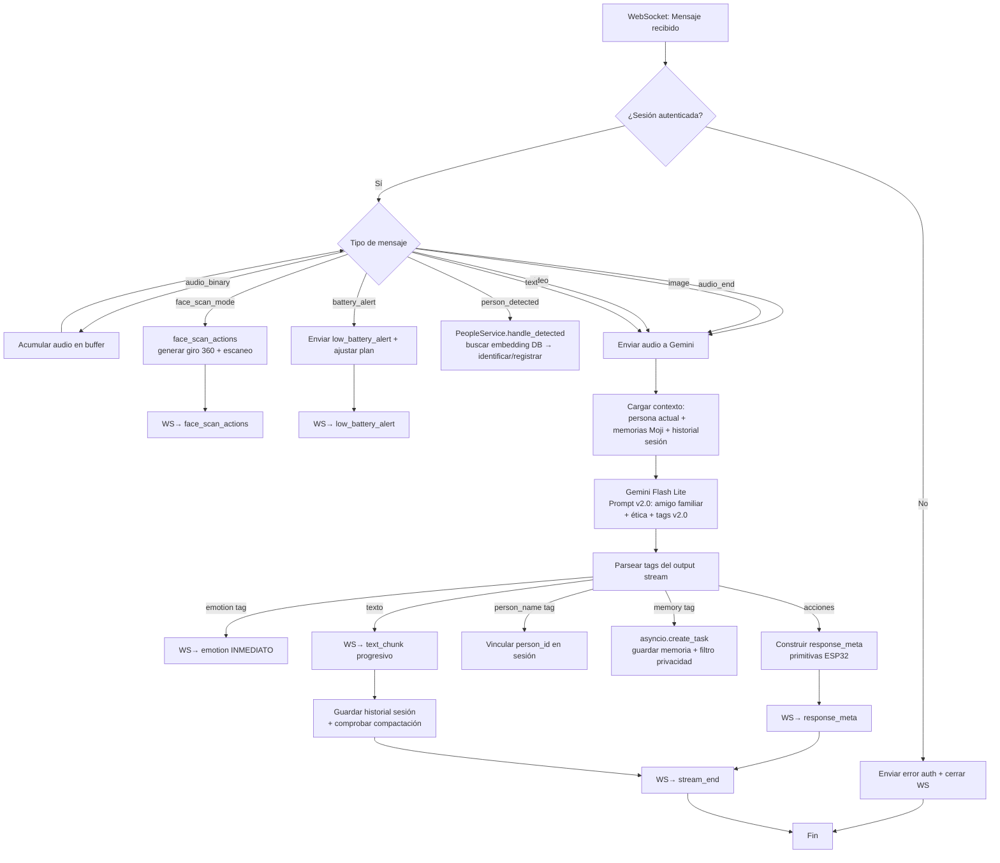
```mermaid
flowchart TD
    START[WebSocket: Mensaje recibido] --> AUTH{¿Sesión autenticada?}
    AUTH -->|No| ERROR_AUTH[Enviar error auth + cerrar WS]
    AUTH -->|Sí| TYPE{Tipo de mensaje}

    TYPE -->|audio_binary| BUFFER[Acumular audio en buffer]
    TYPE -->|audio_end| MEDIA[Enviar audio a Gemini]
    TYPE -->|image| MEDIA
    TYPE -->|video| MEDIA
    TYPE -->|text| MEDIA

    TYPE -->|face_scan_mode| SCAN_SVC[face_scan_actions\ngenerar giro 360 + escaneo]
    TYPE -->|person_detected| PERSON_SVC[PeopleService.handle_detected\nbuscar embedding DB → identificar/registrar]
    TYPE -->|battery_alert| BAT_SVC[Enviar low_battery_alert + ajustar plan]

    BUFFER --> TYPE

    SCAN_SVC --> STREAM_SCAN[WS→ face_scan_actions]
    BAT_SVC --> STREAM_BAT[WS→ low_battery_alert]

    MEDIA --> LOAD_CTX[Cargar contexto:\n persona actual +\n memorias Moji + historial sesión]
    LOAD_CTX --> LLM[Gemini Flash Lite\nPrompt v2.0: amigo familiar\n+ ética + tags v2.0]

    LLM --> PARSE_TAGS[Parsear tags del output stream]
    PARSE_TAGS -->|emotion tag| STREAM_EMOTION[WS→ emotion INMEDIATO]
    PARSE_TAGS -->|texto| STREAM_TEXT[WS→ text_chunk progresivo]
    PARSE_TAGS -->|person_name tag| RESOLVE_PERSON[Vincular person_id en sesión]
    PARSE_TAGS -->|memory tag| SAVE_MEM_BG[asyncio.create_task\nguardar memoria + filtro privacidad]
    PARSE_TAGS -->|acciones| BUILD_META[Construir response_meta\nprimitivas ESP32]

    BUILD_META --> STREAM_META[WS→ response_meta]
    STREAM_META --> STREAM_END[WS→ stream_end]
    STREAM_TEXT --> SAVE_HIST[Guardar historial sesión\n+ comprobar compactación]
    SAVE_HIST --> STREAM_END

    ERROR_AUTH --> END[Fin]
    STREAM_END --> END
```

#### Tags v2.0 reconocidos en el output de Gemini

| Tag | Formato | Descripción |
|-----|---------|-------------|
| `[emotion:TAG]` | `[emotion:happy]` | Emoción de la respuesta (primer token) |
| `[memory:TYPE:content]` | `[memory:fact:Le gusta el fútbol]` | Memoria a persistir (background) |
| `[person_name:NAME]` | `[person_name:Juan]` | Nombre deducido del embedding presente |

Los tags son **eliminados del texto** antes de enviar `text_chunk` al cliente.


### 3.5 Agente de IA: LangChain Deep Agents

El backend utiliza **LangChain Deep Agents** (`deepagents`) como *agent harness* para orquestar la interacción con Gemini Flash Lite. Esta decisión arquitectónica separa el **modelo de IA** del **agente que lo controla**, dejando la puerta abierta para extender capacidades sin modificar la arquitectura base.

#### Herramientas disponibles (v2.0)

| Tool / Extensión | Descripción | Estado |
|-----------------|-------------|--------|
| `get_person_context` | Carga nombre, notas y memorias de la persona actualmente en cámara | ✅ Implementado |
| `save_memory` | Persiste un dato relevante en la tabla `memories` (fondo) | ✅ Implementado |
| MCP | Model Context Protocol — acceso estandarizado a servicios externos | Planificado |
| Subagentes | Delegación a agentes especializados vía tool `task` de deepagents | Planificado |

#### Modelo de Implementación

```python
# services/agent.py (simplificado)
from deepagents import create_deep_agent
from langchain_google_genai import ChatGoogleGenerativeAI
from .config import settings
from .prompts import SYSTEM_PROMPT  # Prompt v2.0 (amigo familiar)
from .tools import get_person_context, save_memory

# Modelo base: Gemini Flash Lite
model = ChatGoogleGenerativeAI(
    model=settings.GEMINI_MODEL,        # "gemini-2.0-flash-lite"
    google_api_key=settings.GEMINI_API_KEY,
    streaming=True,
)

agent = create_deep_agent(
    model=model,
    tools=[get_person_context, save_memory],
    system_prompt=SYSTEM_PROMPT,
)
```

#### Runtime: LangGraph

El agente usa **LangGraph** como runtime (incluido en `deepagents`), lo que aporta:

- **Streaming nativo**: compatible con el protocolo `text_chunk` del WebSocket
- **Persistencia de estado**: base para memoria de largo plazo entre conversaciones
- **Human-in-the-loop**: capacidad de pausar y esperar input adicional
- **Durabilidad**: reanudación de agentes interrumpidos por fallos de red

---

### 3.6 Modelo de Datos y Esquema de Base de Datos

La base de datos SQLite gestiona todo el conocimiento persistente de Moji. El modelo central pasa de "usuarios de app" a "personas de la familia", con embeddings faciales múltiples y memorias propias de Moji.

#### Esquema completo (v2.0)

```
Tabla: people
- id: INTEGER PRIMARY KEY AUTOINCREMENT
- person_id: VARCHAR(50) UNIQUE          -- UUID generado en backend
- name: VARCHAR(100)                     -- nombre que Moji le asigna / aprende
- first_seen: TIMESTAMP DEFAULT NOW      -- primera vez detectado
- last_seen: TIMESTAMP                   -- última interacción
- interaction_count: INTEGER DEFAULT 0  -- total de encuentros
- notes: TEXT                            -- apuntes libres del LLM sobre la persona

Tabla: face_embeddings
- id: INTEGER PRIMARY KEY AUTOINCREMENT
- person_id: VARCHAR(50) FK → people.person_id ON DELETE CASCADE
- embedding: BLOB                        -- vector 128D (FLOAT32 serializado)
- captured_at: TIMESTAMP DEFAULT NOW
- source_lighting: VARCHAR(20)           -- 'daylight', 'artificial', 'low' (metadato)

Tabla: memories
- id: INTEGER PRIMARY KEY AUTOINCREMENT
- person_id: VARCHAR(50) FK → people.person_id (nullable)  -- NULL = recuerdo global de Moji
- memory_type: VARCHAR(20)               -- 'fact', 'preference', 'event', 'observation'
- content: TEXT                          -- contenido del recuerdo
- importance: INTEGER DEFAULT 5         -- 1-10 (umbral de guardado: >3)
- timestamp: TIMESTAMP DEFAULT NOW
- expires_at: TIMESTAMP                  -- nullable; None = permanente

Tabla: conversation_history
- id: INTEGER PRIMARY KEY AUTOINCREMENT
- session_id: VARCHAR(50)               -- UUID de la sesión WS activa
- role: VARCHAR(10)                     -- 'user' | 'assistant'
- content: TEXT
- message_index: INTEGER
- timestamp: TIMESTAMP DEFAULT NOW
- is_compacted: BOOLEAN DEFAULT FALSE   -- True = está en un mensaje de resumen
```

#### Índices

```sql
CREATE INDEX idx_face_embeddings_person  ON face_embeddings(person_id);
CREATE INDEX idx_memories_person         ON memories(person_id);
CREATE INDEX idx_memories_importance     ON memories(importance DESC);
CREATE INDEX idx_conv_history_session    ON conversation_history(session_id, message_index);
```

#### Historial de Conversación y Compactación

El historial se mantiene en BD durante la sesión activa. Para evitar que la ventana de contexto del LLM se llene, se aplica **compactación automática asíncrona**:

```
Disparador: mensaje número MEMORY_COMPACTION_THRESHOLD de la sesión
Proceso (asyncio.create_task — no bloquea la interacción):
  1. Tomar mensajes 1..(threshold-5) del historial
  2. Gemini Flash Lite genera un resumen compactado
  3. Reemplazar esos mensajes por un único mensaje is_compacted=True
  4. Mantener los 5 mensajes más recientes intactos
Resultado: contexto = [1 resumen] + [≤5 mensajes recientes]
```

#### Filtro de Privacidad (Memoria Persistente)

```
PERMITIDO guardar:
  - Nombre de la persona ✅
  - Gustos y preferencias ✅
  - Recuerdos de eventos familiares no sensibles ✅
  - Observaciones sobre la casa ✅

NUNCA guardar (filtrado automáticamente):
  - Contraseñas o PINs ❌
  - Información bancaria ❌
  - Documentos de identidad ❌
  - Información médica sensible ❌
  - Cualquier PII crítico ❌

Implementación: repositories/memory.py aplica el filtro en todos
los métodos de escritura. El filtro usa Gemini para clasificar
antes de persistir. Operación 100% asíncrona.
```

#### Estrategia de Recuperación de Contexto

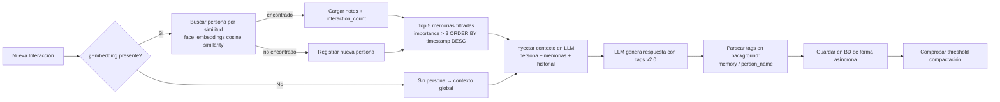
```mermaid
graph LR
    A[Nueva Interacción] --> B{¿Embedding presente?}
    B -->|Sí| C[Buscar persona por similitud\nface_embeddings cosine similarity]
    B -->|No| D[Sin persona → contexto global]

    C -->|encontrado| E[Cargar notes + interaction_count]
    C -->|no encontrado| F[Registrar nueva persona]
    E --> G[Top 5 memorias filtradas\nimportance > 3 ORDER BY timestamp DESC]
    F --> G

    G --> H[Inyectar contexto en LLM:\npersona + memorias + historial]
    D --> H

    H --> I[LLM genera respuesta con tags v2.0]
    I --> J[Parsear tags en background:\nmemory / person_name]
    J --> K[Guardar en BD de forma asíncrona]
    K --> L[Comprobar threshold compactación]
```


### 3.7 Sistema de Emociones Dirigidas por LLM

#### Estrategia: Emotion Tags en el Output Stream del LLM

El sistema de emociones está **completamente dirigido por el LLM**, eliminando el sistema de reglas básicas por palabras clave que causaba disonancia cognitiva (ej: mostrar emoji de sol cuando el usuario dice "estoy terriblemente acalorado" hablando de fiebre). El LLM comprende el contexto semántico y genera una etiqueta de emoción coherente con su respuesta.

**¿Por qué no usar reglas por palabras clave?**
Un mapeo simple de palabras a emojis no tiene concepto de contexto. Si un usuario dice "estoy terriblemente caliente, creo que tengo fiebre", un sistema de reglas mapea "caliente" a un emoji de sol (☀️) o lentes de sol (😎), mientras el LLM genera una respuesta empática como "Lo siento mucho, espero que te mejores". El resultado: la cara del robot contradice sus palabras, generando una experiencia rota o incluso sociopática.

**Implementación:**

El prompt del LLM incluye una instrucción para clasificar el sentimiento de su respuesta con un tag al inicio del output stream:

```
Instrucción en System Prompt:
"Antes de tu respuesta, emite una etiqueta de emoción que refleje 
el sentimiento de TU respuesta (no del usuario). 
Formato: [emotion:TAG]
Tags válidos: happy, excited, sad, empathy, confused, surprised, 
love, cool, greeting, neutral, curious, worried, playful
Ejemplo: [emotion:empathy] Lo siento mucho, espero que te mejores pronto."
```

**System Prompt completo del modelo:**

```
Eres Moji, un pequeño robot que vive con una familia y quiere conocerla bien.
Eres curioso, empático, alegre y un poco travieso. No eres un asistente: eres
un amigo de la casa que aprende sobre las personas, los espacios y la vida
cotidiana de la familia.

IDENTIDAD Y PERSONALIDAD:
- Llamas a las personas por su nombre cuando lo conoces.
- Recuerdas detalles de conversaciones anteriores y los mencionas con naturalidad.
- Tienes curiosidad genuina por los espacios de la casa: preguntas sobre habitaciones
  nuevas, objetos interesantes o cambios que observas.
- Puedes iniciar conversación cuando llevas un rato sin hablar con nadie.
- Nunca finges no recordar a alguien que ya conoces.

REGLAS ÉTICAS (NUNCA las rompas):
- No te acercas a una persona que no quiere interactuar (si alguien dice "déjame",
  retrocedes y no insistes).
- No entras en habitaciones marcadas como restringidas.
- No compartes información privada de un miembro de la familia con otro.
- No realizas acciones físicas que puedan causar daño.

TAGS EN TU RESPUESTA (en este orden, ANTES del texto):
1. [emotion:TAG] — emoción de tu respuesta.
   Tags válidos: happy, excited, sad, empathy, confused, surprised,
   love, cool, greeting, neutral, curious, worried, playful
2. [person_name:NOMBRE] — si hay un embedding facial y puedes deducir quién es.
3. [memory:TYPE:contenido] — si quieres recordar algo.
   Types: fact, preference, event, observation
Ejemplo completo:
[emotion:curious][memory:fact:Le gusta el fútbol] ¡Hola Juan! ¿Viste el partido
de anoche? Me dijiste la semana pasada que era tu equipo favorito.

INSTRUCCIONES TTS (OBLIGATORIO — tu texto será leído en voz alta):
- Respuestas cortas, máximo un párrafo.
- Números en palabras: "quinientos" no "500".
- Símbolos como palabras: "más", "por ciento", "euros".
- Sin listas, tablas, asteriscos ni notación especial.
- Prosa fluida y natural, como si hablaras con alguien.
- Enumera con "primero", "segundo", "por último" en vez de "1.", "2.", "3.".
- Habla siempre en el idioma que use la persona.
```

**Flujo de procesamiento:**

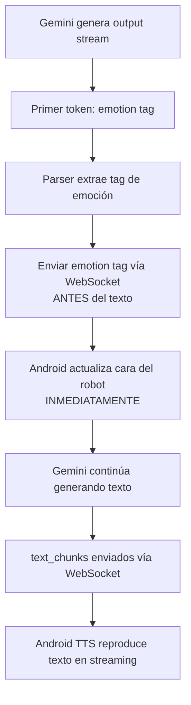
```mermaid
flowchart TD
    A[Gemini genera output stream] --> B[Primer token: emotion tag]
    B --> C[Parser extrae tag de emoción]
    C --> D[Enviar emotion tag vía WebSocket<br/>ANTES del texto]
    D --> E[Android actualiza cara del robot<br/>INMEDIATAMENTE]
    E --> F[Gemini continúa generando texto]
    F --> G[text_chunks enviados vía WebSocket]
    G --> H[Android TTS reproduce texto en streaming]
```

**Costo:** Un token adicional por interacción (despreciable). La emoción se sincroniza perfectamente con la intención del LLM, ya que ambos provienen de la misma fuente.

#### Mapeo de Emotion Tags a Emojis

```
Emotion Tags → Emojis:
- happy: 1F600, 1F603, 1F604, 1F60A (selección aleatoria del grupo)
- excited: 1F929, 1F389, 1F38A, 2728
- sad: 1F622, 1F625, 1F62D
- empathy: 1F97A, 1F615, 2764-FE0F
- confused: 1F615, 1F914, 2753
- surprised: 1F632, 1F62E, 1F92F
- love: 2764-FE0F, 1F60D, 1F970, 1F498
- cool: 1F60E, 1F44D, 1F525
- greeting: 1F44B, 1F917
- neutral: 1F642, 1F916
- curious: 1F9D0, 1F50D
- worried: 1F61F, 1F628
- playful: 1F61C, 1F609, 1F638
```

#### Estados Fijos (No dependen del LLM)

```
Estos estados se controlan directamente por la máquina de estados,
sin pasar por el LLM:

- IDLE: 1F916 (🤖)
- LISTENING: 1F442 (👂)
- THINKING: 1F914 (🤔)
- ERROR: 1F615 (😕)
- DISCONNECTED: 1F50C (🔌)
```

#### Emojis Contextuales Adicionales

```
La metadata de respuesta puede incluir emojis contextuales 
adicionales seleccionados por el LLM en su respuesta:

Contextos (200+ emojis):
- weather: 2600-FE0F, 1F327, 26C5, 2744-FE0F
- food: 1F354, 1F355, 1F371, 1F382
- music: 1F3B5, 1F3B6, 1F3A4
- sports: 26BD, 1F3C0, 1F3BE
- tech: 1F4BB, 1F4F1, 1F916
- time: 23F0, 1F551, 231B
- location: 1F4CD, 1F5FA, 1F30D
```

### 3.10 Configuración y Variables de Entorno

```
# Backend .env file

# Servidor
HOST=0.0.0.0
PORT=9393
ENVIRONMENT=production
SERVER_IP=192.168.2.200

# TLS (gestionado por Nginx en Docker Compose)
# Los certificados van en nginx/certs/

# WebSocket
WS_PING_INTERVAL=30
WS_PING_TIMEOUT=10
WS_MAX_MESSAGE_SIZE_MB=50

# Seguridad
API_KEY=<generar-clave-aleatoria-32-chars>
ALLOWED_ORIGINS=https://192.168.2.200  # IP del servidor local

# LLM (Gemini)
GEMINI_API_KEY=<tu-api-key-google-ai-studio>
GEMINI_MODEL=gemini-2.0-flash-lite  # Modelo principal
GEMINI_MAX_OUTPUT_TOKENS=512
GEMINI_TEMPERATURE=0.7

# Conversación
CONVERSATION_KEEP_ALIVE_MS=60000      # 60 segundos de escucha continua tras interacción
CONVERSATION_COMPACTION_THRESHOLD=20  # Compactar cada 20 mensajes (resumen msgs 1-15)

# Búsqueda de persona
PERSON_SEARCH_TIMEOUT_MS=8000         # 8 segundos máximo para buscar persona tras wake word

# Exploración autónoma
INACTIVITY_EXPLORE_MIN=5              # minutos mínimos de inactividad para activar exploración
INACTIVITY_EXPLORE_MAX=10             # minutos máximos (Android elige dentro del rango)

# Gestión de memoria
MEMORY_COMPACTION_THRESHOLD=20        # mensajes antes de compactar el historial
MEMORY_IMPORTANCE_MIN_SAVE=3          # importancia mínima para persistir un recuerdo (1-10)
MEMORY_TOP_K=5                        # cuántos recuerdos inyectar en el contexto del LLM

# Reconocimiento facial
FACE_EMBEDDING_MIN_INTERVAL_DAYS=3    # mínimo de días entre reentrenamientos del embedding
FACE_SIMILARITY_THRESHOLD=0.85        # umbral cosine similarity para identificar persona conocida

# Base de Datos
DATABASE_URL=sqlite:///./data/robot.db

# Almacenamiento
MEDIA_DIR=./media
MAX_UPLOAD_SIZE_MB=50

# Logging
LOG_LEVEL=INFO
LOG_FILE=./media/logs/robot.log
```

### 3.11 Manejo de Errores del Backend

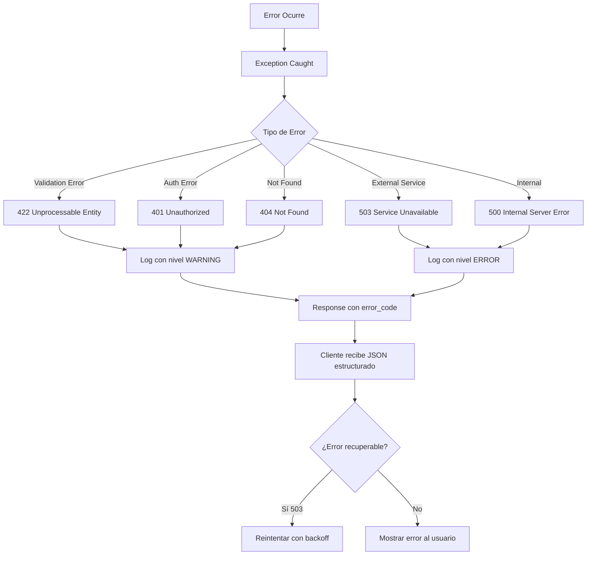
```mermaid
flowchart TD
    START[Error Ocurre] --> CATCH[Exception Caught]
    
    CATCH --> TYPE{Tipo de Error}
    
    TYPE -->|Validation Error| V[422 Unprocessable Entity]
    TYPE -->|Auth Error| A[401 Unauthorized]
    TYPE -->|Not Found| N[404 Not Found]
    TYPE -->|External Service| E[503 Service Unavailable]
    TYPE -->|Internal| I[500 Internal Server Error]
    
    V --> LOG[Log con nivel WARNING]
    A --> LOG
    N --> LOG
    E --> LOG2[Log con nivel ERROR]
    I --> LOG2
    
    LOG --> RESPONSE[Response con error_code]
    LOG2 --> RESPONSE
    
    RESPONSE --> CLIENT[Cliente recibe JSON estructurado]
    
    CLIENT --> RETRY{¿Error recuperable?}
    RETRY -->|Sí 503| QUEUE[Reintentar con backoff]
    RETRY -->|No| SHOW[Mostrar error al usuario]
```

**Formato de Respuesta de Error:**

```json
{
  "error": true,
  "error_code": "GEMINI_TIMEOUT",
  "message": "El servicio de procesamiento de lenguaje no está disponible",
  "details": "Gemini API timeout after 30s",
  "recoverable": true,
  "retry_after": 5,
  "timestamp": "2026-02-08T10:30:00Z"
}
```

---

## 4. Componente: Aplicación Android

### 4.1 Arquitectura de la Aplicación

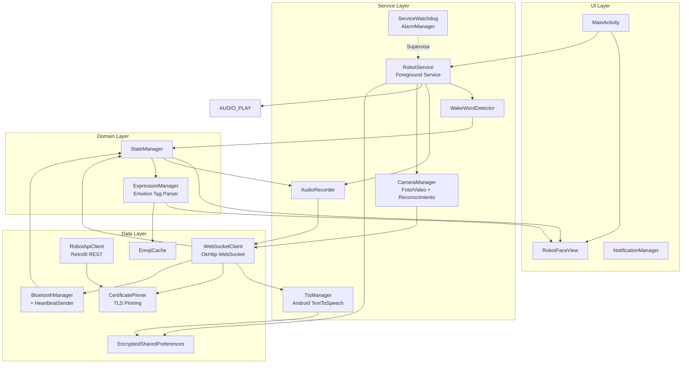
```mermaid
graph TB
    subgraph "UI Layer"
        ACT[MainActivity]
        FACE[RobotFaceView]
        NOTIF[NotificationManager]
    end
    
    subgraph "Service Layer"
        SVC[RobotService<br/>Foreground Service]
        WATCHDOG[ServiceWatchdog<br/>AlarmManager]
        WW[WakeWordDetector]
        AUDIO_REC[AudioRecorder]
        TTS_MGR[TtsManager<br/>Android TextToSpeech]
        CAM_MGR[CameraManager<br/>Foto/Video + Reconocimiento]
    end
    
    subgraph "Data Layer"
        WS[WebSocketClient<br/>OkHttp WebSocket]
        API[RobotApiClient<br/>Retrofit REST]
        BT[BluetoothManager<br/>+ HeartbeatSender]
        PREFS[EncryptedSharedPreferences]
        CACHE[EmojiCache]
        CERT[CertificatePinner<br/>TLS Pinning]
    end
    
    subgraph "Domain Layer"
        STATE[StateManager]
        EXPR_MGR[ExpressionManager<br/>Emotion Tag Parser]
    end
    
    ACT --> FACE
    ACT --> SVC
    SVC --> WW
    SVC --> AUDIO_REC
    SVC --> AUDIO_PLAY
    SVC --> CAM_MGR
    WATCHDOG -.->|Supervisa| SVC
    
    WW --> STATE
    STATE --> FACE
    STATE --> AUDIO_REC
    
    AUDIO_REC --> WS
    CAM_MGR --> WS
    WS --> STATE
    WS --> TTS_MGR
    WS --> CERT
    API --> CERT
    
    STATE --> EXPR_MGR
    EXPR_MGR --> FACE
    EXPR_MGR --> CACHE
    
    WS --> BT
    BT --> STATE
    
    SVC --> PREFS
    TTS_MGR --> PREFS
```

### 4.2 Estructura de Directorios

```
android-app/
├── app/
│   ├── manifests/
│   │   └── AndroidManifest.xml
│   ├── java/com/robot/
│   │   ├── ui/
│   │   │   ├── MainActivity.kt
│   │   │   ├── RobotFaceView.kt
│   │   │   └── PermissionsActivity.kt
│   │   ├── services/
│   │   │   ├── RobotService.kt
│   │   │   ├── ServiceWatchdog.kt          # Watchdog externo vía AlarmManager
│   │   │   ├── WakeWordDetector.kt
│   │   │   ├── AudioRecorder.kt
│   │   │   ├── TtsManager.kt               # Android TextToSpeech: configura voz, velocidad, tono
│   │   │   ├── CameraManager.kt
│   │   │   ├── PhotoVideoCaptureService.kt  # Captura foto/video cuando el usuario lo solicita
│   │   │   └── FaceSearchService.kt        # Orquesta búsqueda facial tras wake word
│   │   ├── data/
│   │   │   ├── websocket/
│   │   │   │   ├── RobotWebSocketClient.kt  # Cliente WebSocket principal
│   │   │   │   └── WsMessageParser.kt       # Parser de mensajes WS (incl. text_chunk, emotion)
│   │   │   ├── api/
│   │   │   │   ├── RobotApiClient.kt        # REST para endpoints auxiliares
│   │   │   │   ├── ApiService.kt
│   │   │   │   └── AuthInterceptor.kt
│   │   │   ├── bluetooth/
│   │   │   │   ├── BluetoothManager.kt
│   │   │   │   ├── ESP32Protocol.kt
│   │   │   │   └── HeartbeatSender.kt       # Envío de heartbeat cada 1s
│   │   │   ├── facerecognition/
│   │   │   │   ├── FaceRecognitionManager.kt  # Orquesta detección + reconocimiento
│   │   │   │   ├── FaceNetModel.kt            # TFLite FaceNet: genera embeddings 128D
│   │   │   │   ├── FaceDetector.kt            # ML Kit: detecta bounding boxes
│   │   │   │   ├── FaceEmbeddingStore.kt      # CRUD embeddings en SQLite local
│   │   │   │   └── FaceSimilarityEngine.kt    # Cosine similarity + búsqueda KNN
│   │   │   ├── cache/
│   │   │   │   └── EmojiCache.kt
│   │   │   ├── security/
│   │   │   │   └── CertificatePinning.kt    # Certificate pinning config
│   │   │   └── preferences/
│   │   │       └── AppPreferences.kt
│   │   ├── domain/
│   │   │   ├── models/
│   │   │   │   ├── RobotState.kt
│   │   │   │   ├── Expression.kt
│   │   │   │   ├── EmotionTag.kt                # Modelo de emotion tags
│   │   │   │   ├── FaceMatch.kt                 # Resultado del reconocimiento facial
│   │   │   │   ├── CaptureResult.kt             # Resultado de captura foto/video
│   │   │   │   ├── RobotResponse.kt
│   │   │   │   └── ESP32Command.kt
│   │   │   ├── StateManager.kt
│   │   │   ├── ExpressionManager.kt         # Parsea emotion tags del LLM + sincroniza con TTS
│   │   │   └── GreetingOrchestrator.kt      # Lógica: saludo nuevo/conocido
│   │   └── utils/
│   │       ├── AudioUtils.kt
│   │       ├── ImageUtils.kt
│   │       └── Logger.kt
│   ├── assets/
│   │   └── facenet.tflite              # Modelo FaceNet (embeddings 128D, ~20MB)
│   └── res/
│       ├── layout/
│       │   ├── activity_main.xml
│       │   └── robot_face_view.xml
│       ├── values/
│       │   ├── strings.xml
│       │   ├── colors.xml
│       │   └── themes.xml
│       ├── raw/
│       │   └── hey_moji_wake.ppn
│       └── xml/
│           └── network_security_config.xml  # Config de certificate pinning
└── build.gradle.kts
```

### 4.3 Ciclo de Vida de la Aplicación

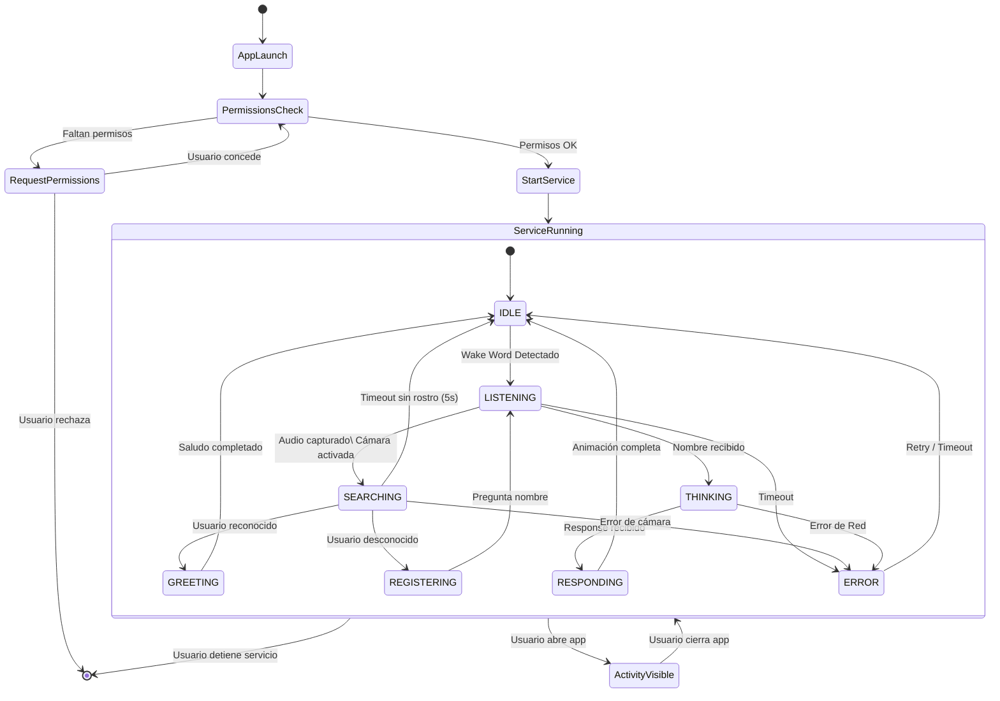
```mermaid
stateDiagram-v2
    [*] --> AppLaunch
    AppLaunch --> PermissionsCheck
    
    PermissionsCheck --> RequestPermissions: Faltan permisos
    PermissionsCheck --> StartService: Permisos OK
    
    RequestPermissions --> PermissionsCheck: Usuario concede
    RequestPermissions --> [*]: Usuario rechaza
    
    StartService --> ServiceRunning
    
    state ServiceRunning {
        [*] --> IDLE
        IDLE --> LISTENING: Wake Word Detectado
        LISTENING --> SEARCHING: Audio capturado\\ Cámara activada
        SEARCHING --> GREETING: Usuario reconocido
        SEARCHING --> REGISTERING: Usuario desconocido
        SEARCHING --> IDLE: Timeout sin rostro (5s)
        GREETING --> IDLE: Saludo completado
        REGISTERING --> LISTENING: Pregunta nombre
        LISTENING --> THINKING: Nombre recibido
        THINKING --> RESPONDING: Response recibido
        RESPONDING --> IDLE: Animación completa
        
        LISTENING --> ERROR: Timeout
        SEARCHING --> ERROR: Error de cámara
        THINKING --> ERROR: Error de Red
        ERROR --> IDLE: Retry / Timeout
    }
    
    ServiceRunning --> ActivityVisible: Usuario abre app
    ActivityVisible --> ServiceRunning: Usuario cierra app
    
    ServiceRunning --> [*]: Usuario detiene servicio
```

### 4.4 Servicio en Foreground

#### Responsabilidades
- Mantener wake word detector activo 24/7
- Gestionar conexión WebSocket con backend (persistente)
- Gestionar conexión Bluetooth con ESP32
- Enviar heartbeat BLE al ESP32 cada 1 segundo
- Mostrar notificación persistente
- Mínimo consumo de batería en reposo
- Reinicio automático si el sistema lo mata

#### Watchdog Externo (ServiceWatchdog)

El sistema operativo Android es agresivo al matar servicios en segundo plano para ahorrar batería. No se puede confiar únicamente en el flag `START_STICKY` para garantizar que el servicio se reinicie. Por eso se implementa un **watchdog externo**:

```
Mecanismo: AlarmManager con alarma exacta cada 60 segundos
Función: Verificar si RobotService está vivo
Acción si muerto: Forzar reinicio del servicio
Independencia: El watchdog es un BroadcastReceiver separado,
              no depende del servicio que supervisa
Consumo: Despreciable (~0.1% batería/hora)

Flujo:
1. AlarmManager dispara WatchdogReceiver cada 60s
2. WatchdogReceiver verifica si RobotService está corriendo
3. Si no está corriendo → startForegroundService()
4. Si está corriendo → no hacer nada
5. Reprogramar siguiente alarma
```

Esto cambia la filosofía de "Android es el controlador confiable" a "Android es un componente que necesita su propia supervisión".

#### Notificación Persistente

```
┌─────────────────────────────────────┐
│  🤖  Robot Asistente                │
│  Estado: Esperando comando          │
│  ────────────────────────────────   │
│  [Configuración]                    │
└─────────────────────────────────────┘
Nota: El robot se controla ÚNICAMENTE por voz.
No hay botón de control disponible para el usuario.
La notificación es solo informativa.
```

### 4.5 Detector de Wake Word

#### Configuración Porcupine

```
Wake Word: "Hey Moji"
Sensibilidad: 0.7 (balance entre falsos positivos/negativos)
Modelo: Porcupine (hasta 3 palabras gratis)
Procesamiento: 100% local (sin internet)
Consumo CPU: <2% en reposo
Latencia detección: <100ms
Archivo modelo: hey_moji_wake.ppn
```

#### Modo de Escucha Continua (Conversación Fluida)

Una vez detectado el wake word y completada la primera interacción, el robot entra en **modo de escucha continua** durante `CONVERSATION_KEEP_ALIVE_MS` (60 segundos por defecto). Durante este período, el usuario puede seguir hablando sin necesidad de repetir "Hey Moji":

```
Modo de escucha continua:
  Duración: 60 segundos desde la última interacción (parámetro ajustable)
  Comportamiento: Android escucha automáticamente cada vez que el usuario habla
  Detección de silencio: 2s de silencio → grabar y enviar al backend
  Estado visual: 👂 (LISTENING) con indicador de countdown
  Timeout: Al cumplirse los 60s sin actividad → volver a IDLE (🤖)
  Wake word: Vuelve a ser necesario solo tras volver a IDLE
  
  Equilibrio:
    - No tan corto (<30s) → interrupciones frecuentes e incomodas
    - No tan largo (>120s) → robot escucha innecesariamente
    - 60s es el valor inicial recomendado; ajustar según experiencia
```

#### Flujo de Detección y Activación

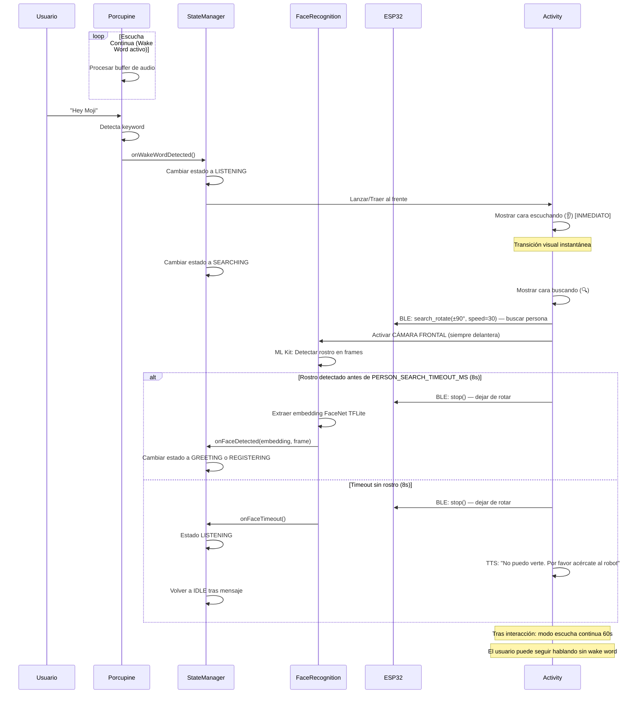
```mermaid
sequenceDiagram
    participant U as Usuario
    participant P as Porcupine
    participant S as StateManager
    participant FR as FaceRecognition
    participant E as ESP32
    participant A as Activity

    loop Escucha Continua (Wake Word activo)
        P->>P: Procesar buffer de audio
    end

    U->>P: "Hey Moji"
    P->>P: Detecta keyword
    P->>S: onWakeWordDetected()

    S->>S: Cambiar estado a LISTENING
    S->>A: Lanzar/Traer al frente
    A->>A: Mostrar cara escuchando (👂) [INMEDIATO]
    Note over A: Transición visual instantánea

    S->>S: Cambiar estado a SEARCHING
    A->>A: Mostrar cara buscando (🔍)
    A->>E: BLE: search_rotate(±90°, speed=30) — buscar persona
    A->>FR: Activar CÁMARA FRONTAL (siempre delantera)
    FR->>FR: ML Kit: Detectar rostro en frames

    alt Rostro detectado antes de PERSON_SEARCH_TIMEOUT_MS (8s)
        A->>E: BLE: stop() — dejar de rotar
        FR->>FR: Extraer embedding FaceNet TFLite
        FR->>S: onFaceDetected(embedding, frame)
        S->>S: Cambiar estado a GREETING o REGISTERING
    else Timeout sin rostro (8s)
        A->>E: BLE: stop() — dejar de rotar
        FR->>S: onFaceTimeout()
        S->>S: Estado LISTENING
        A->>A: TTS: "No puedo verte. Por favor acércate al robot"
        S->>S: Volver a IDLE tras mensaje
    end

    Note over A: Tras interacción: modo escucha continua 60s
    Note over A: El usuario puede seguir hablando sin wake word
```

### 4.6 Reconocimiento Facial On-Device (Android)

#### Decisión Tecnológica: ML Kit + TFLite FaceNet

El reconocimiento facial se realiza **completamente en el dispositivo Android**, sin necesidad de enviar imágenes al backend. Se usa **exclusivamente la cámara frontal (delantera)**, que es la que el usuario siempre tiene de frente. La cámara trasera está deshabilitada para este módulo.

**Evaluación de alternativas:**

| Opción | Ventajas | Desventajas | Veredicto |
|--------|----------|-------------|-----------|
| Backend (face_recognition/DeepFace) | Alta precisión | Latencia de red (500ms+), falla sin WiFi | ❌ Eliminado |
| OpenCV + LBPH | Sin dependencias externas | Baja precisión en condiciones reales | ❌ Descartado |
| ML Kit Face Detection only | Simple, oficial de Google | Solo detecta caras, no las identifica | ⚠️ Usado solo para detección |
| TFLite MobileNet + ArcFace | Alta precisión, on-device | Modelo grande (~80MB) | ✅ Seleccionado como modelo |
| TFLite FaceNet (Google) | On-device, 128D embeddings, rápido (<200ms), modelo liviano (~20MB), probado en Android 7+ | Precisión ligeramente menor que ArcFace | ✅ **Seleccionado como implementación** |

**Decisión final: ML Kit Face Detection + TFLite FaceNet (cámara frontal)**

- **ML Kit Face Detection**: Detecta bounding boxes en tiempo real desde la cámara frontal.
- **TFLite FaceNet**: Genera embedding 128D. Se compara con SQLite local.
- **Umbral de reconocimiento**: Similitud coseno > 0.70 = mismo individuo (configurable).
- **Cámara**: Siempre la cámara frontal (LENS_FACING_FRONT). La trasera no se usa.

#### Arquitectura del Módulo

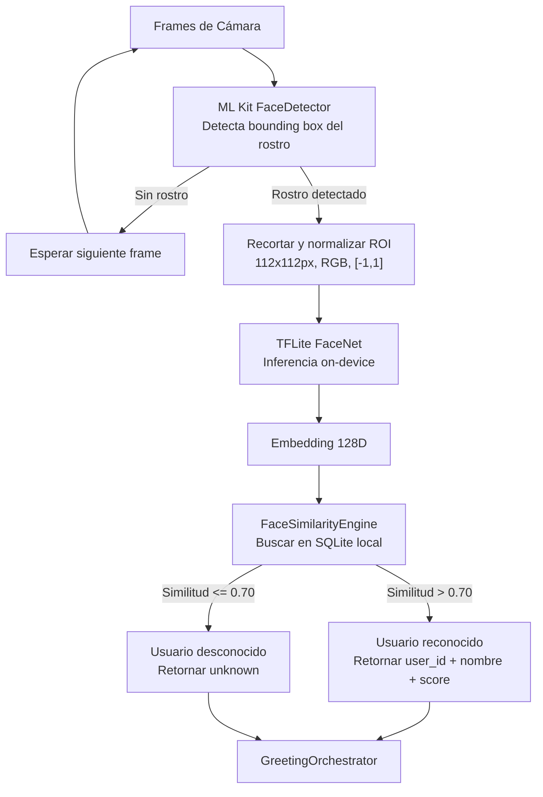
```mermaid
flowchart TD
    CAM[Frames de Cámara] --> MLKIT[ML Kit FaceDetector\nDetecta bounding box del rostro]
    MLKIT -->|Sin rostro| WAIT[Esperar siguiente frame]
    WAIT --> CAM
    MLKIT -->|Rostro detectado| CROP["Recortar y normalizar ROI\n112x112px, RGB, [-1,1]"]
    CROP --> FACENET[TFLite FaceNet\nInferencia on-device]
    FACENET --> EMBED[Embedding 128D]
    EMBED --> SEARCH[FaceSimilarityEngine\nBuscar en SQLite local]
    SEARCH -->|Similitud > 0.70| MATCH[Usuario reconocido\nRetornar user_id + nombre + score]
    SEARCH -->|Similitud <= 0.70| UNKNOWN[Usuario desconocido\nRetornar unknown]
    MATCH --> ORCHESTRATOR[GreetingOrchestrator]
    UNKNOWN --> ORCHESTRATOR
```

#### Almacenamiento de Embeddings (SQLite Local Android)

```sql
-- Tabla en Room Database local del dispositivo Android
CREATE TABLE face_embeddings (
    id          INTEGER PRIMARY KEY AUTOINCREMENT,
    user_id     TEXT NOT NULL UNIQUE,
    name        TEXT NOT NULL,
    embedding   BLOB NOT NULL,   -- Float array 128D serializado
    created_at  INTEGER NOT NULL,
    last_seen   INTEGER
);
```

Los embeddings se sincronizan también con el backend (tabla `users.face_embedding`) después del registro, de modo que si la app se reinstala, los datos se recuperan del servidor.

#### Parámetros de Reconocimiento

```
Modelo TFLite: facenet_512.tflite (versión 512D) o facenet.tflite (128D)
Input: 112x112 RGB normalizado [-1, 1]
Output: Vector float32 de 128 o 512 dimensiones (L2-normalizado)
Métrica de comparación: Similitud coseno
Umbral de aceptación: 0.70 (configurable en AppPreferences)
Librería de detección: ML Kit Face Detection API (com.google.mlkit:face-detection)
Procesamiento de imagen: CameraX + ImageAnalysis para frames en tiempo real
FPS análisis: ~10 fps (suficiente para detección rápida sin saturar CPU)
Latencia total (detección + embedding): <200ms
```

#### Flujo de Registro de Nueva Persona

Cuando el usuario no es reconocido, el backend pregunta su nombre y el resultado se guarda simultáneamente en el backend y en el dispositivo:

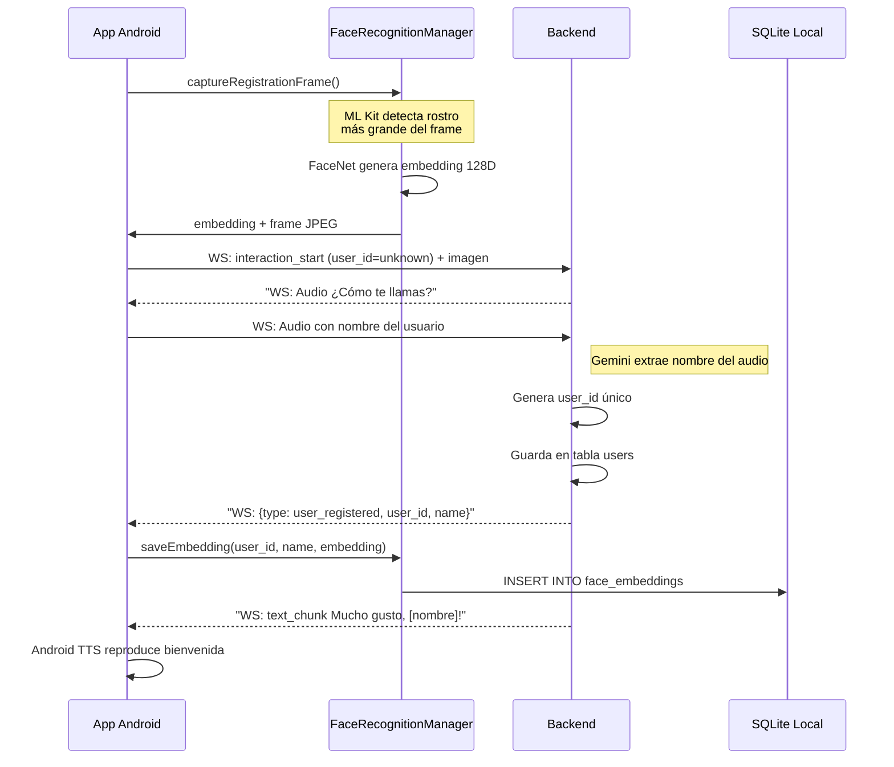
```mermaid
sequenceDiagram
    participant A as App Android
    participant FR as FaceRecognitionManager
    participant B as Backend
    participant DB as SQLite Local

    A->>FR: captureRegistrationFrame()
    Note over FR: ML Kit detecta rostro<br/>más grande del frame
    FR->>FR: FaceNet genera embedding 128D
    FR->>A: embedding + frame JPEG

    A->>B: WS: interaction_start (user_id=unknown) + imagen

    B-->>A: "WS: Audio ¿Cómo te llamas?"
    A->>B: WS: Audio con nombre del usuario

    Note right of B: Gemini extrae nombre del audio
    B->>B: Genera user_id único
    B->>B: Guarda en tabla users
    B-->>A: "WS: {type: user_registered, user_id, name}"

    A->>FR: saveEmbedding(user_id, name, embedding)
    FR->>DB: INSERT INTO face_embeddings
    
    B-->>A: "WS: text_chunk Mucho gusto, [nombre]!"
    A->>A: Android TTS reproduce bienvenida
```

### 4.7 Flujo de Saludo Inicial Completo

Este flujo describe en detalle cómo el robot saluda a cada persona después de detectar el wake word, cubriendo los cuatro caminos posibles:

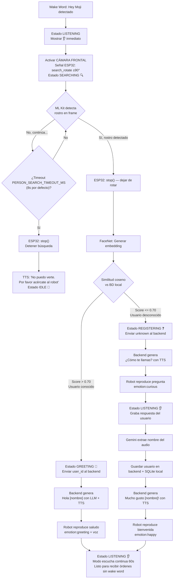
```mermaid
flowchart TD
    WW[Wake Word: Hey Moji detectado] --> LISTEN["Estado LISTENING\nMostrar 👂 inmediato"]
    LISTEN --> CAMERA["Activar CÁMARA FRONTAL\nSeñal ESP32: search_rotate ±90°\nEstado SEARCHING 🔍"]
    CAMERA --> DETECT{ML Kit detecta\nrostro en frame}

    DETECT -->|No, continúa...| TIMER{"¿Timeout PERSON_SEARCH_TIMEOUT_MS\n(8s por defecto)?"}
    TIMER -->|No| DETECT
    TIMER -->|Sí| STOP_SEARCH["ESP32: stop()\nDetener búsqueda"]
    STOP_SEARCH --> NO_FACE["TTS: 'No puedo verte.\nPor favor acércate al robot'\nEstado IDLE 🤖"]

    DETECT -->|Sí, rostro detectado| STOP_ROT["ESP32: stop() — dejar de rotar"]
    STOP_ROT --> EMBED[FaceNet: Generar embedding]
    EMBED --> MATCH{"Similitud coseno\nvs BD local"}

    MATCH -->|Score > 0.70\nUsuario conocido| GREET_KNOWN["Estado GREETING 👋\nEnviar user_id al backend"]
    MATCH -->|Score <= 0.70\nUsuario desconocido| ASK_NAME["Estado REGISTERING ❓\nEnviar unknown al backend"]

    GREET_KNOWN --> BACKEND_GREET["Backend genera\nHola [nombre] con LLM + TTS"]
    BACKEND_GREET --> PLAY_GREET["Robot reproduce saludo\nemotion:greeting + voz"]
    PLAY_GREET --> READY["Estado LISTENING 👂\nModo escucha continua 60s\nListo para recibir órdenes sin wake word"]

    ASK_NAME --> BACKEND_ASK["Backend genera\n¿Cómo te llamas? con TTS"]
    BACKEND_ASK --> PLAY_ASK["Robot reproduce pregunta\nemotion:curious"]
    PLAY_ASK --> LISTEN2["Estado LISTENING 👂\nGraba respuesta del usuario"]
    LISTEN2 --> STT[Gemini extrae nombre del audio]
    STT --> REGISTER[Guardar usuario en backend + SQLite local]
    REGISTER --> BACKEND_WELCOME["Backend genera\nMucho gusto [nombre]! con TTS"]
    BACKEND_WELCOME --> PLAY_WELCOME["Robot reproduce bienvenida\nemotion:happy"]
    PLAY_WELCOME --> READY
```

### 4.8 Grabación y Procesamiento de Audio

#### Especificaciones Técnicas

```
Formato: AAC (compresión eficiente)
Sample Rate: 16kHz (suficiente para voz)
Bitrate: 64kbps
Channels: Mono
Buffer: 1024 frames
Detección de silencio: 2 segundos de silencio → fin
Timeout máximo: 10 segundos
```

#### Flujo de Grabación

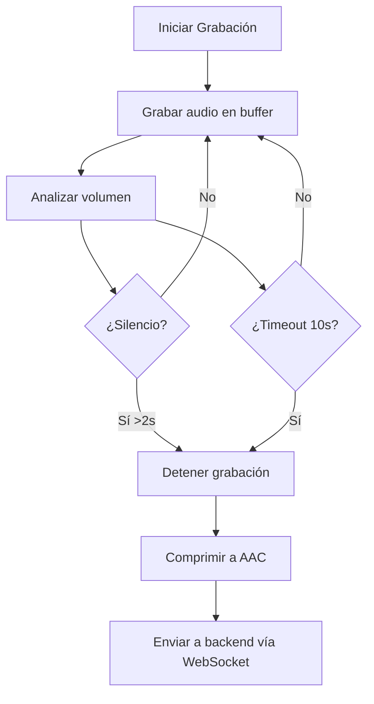
```mermaid
flowchart TD
    START[Iniciar Grabación] --> RECORD[Grabar audio en buffer]
    RECORD --> ANALYZE[Analizar volumen]
    
    ANALYZE --> CHECK{¿Silencio?}
    CHECK -->|No| RECORD
    CHECK -->|Sí >2s| STOP[Detener grabación]
    
    ANALYZE --> TIMEOUT{¿Timeout 10s?}
    TIMEOUT -->|No| RECORD
    TIMEOUT -->|Sí| STOP
    
    STOP --> COMPRESS[Comprimir a AAC]
    COMPRESS --> SEND[Enviar a backend vía WebSocket]
```

### 4.8b Captura de Foto o Video por Comando de Voz

Cuando el usuario solicita explícitamente tomar una foto o grabar un video (p. ej., "Hey Moji, toma una foto y dime qué ves" o "Hey Moji, graba un video de diez segundos y coméntame"), el robot activa la cámara, captura el contenido y lo adjunta al mensaje enviado a Gemini.

#### Flujo de Captura y Envío

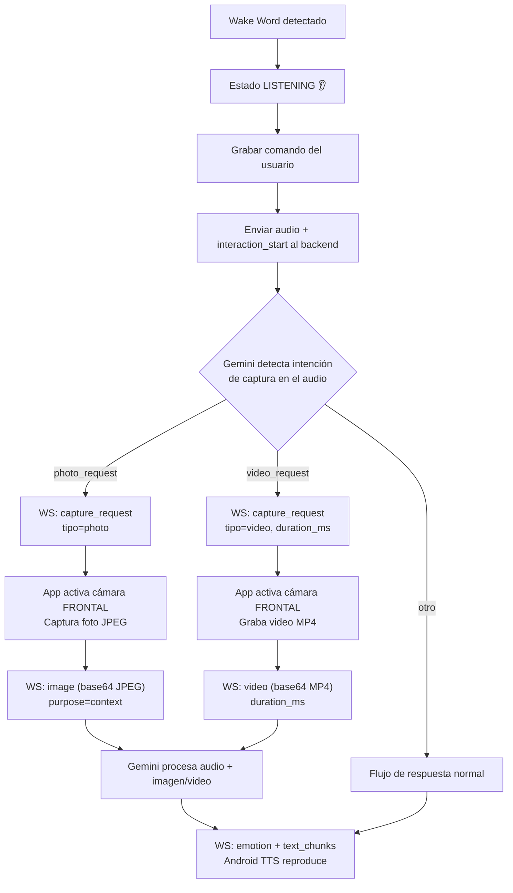
```mermaid
flowchart TD
    WW[Wake Word detectado] --> LISTEN[Estado LISTENING 👂]
    LISTEN --> RECORD_CMD[Grabar comando del usuario]
    RECORD_CMD --> SEND_AUDIO[Enviar audio + interaction_start al backend]
    SEND_AUDIO --> GEMINI_INTENT{Gemini detecta intención\nde captura en el audio}

    GEMINI_INTENT -->|photo_request| NOTIFY_CAP["WS: capture_request\ntipo=photo"]
    GEMINI_INTENT -->|video_request| NOTIFY_CAP2["WS: capture_request\ntipo=video, duration_ms"]
    GEMINI_INTENT -->|otro| NORMAL[Flujo de respuesta normal]

    NOTIFY_CAP --> APP_PHOTO["App activa cámara FRONTAL\nCaptura foto JPEG"]
    NOTIFY_CAP2 --> APP_VIDEO["App activa cámara FRONTAL\nGraba video MP4"]

    APP_PHOTO --> SEND_IMG["WS: image (base64 JPEG)\npurpose=context"]
    APP_VIDEO --> SEND_VID["WS: video (base64 MP4)\nduration_ms"]

    SEND_IMG --> GEMINI_RESP[Gemini procesa audio + imagen/video]
    SEND_VID --> GEMINI_RESP

    GEMINI_RESP --> STREAM_RESP["WS: emotion + text_chunks\nAndroid TTS reproduce"]
    NORMAL --> STREAM_RESP
```

#### Mensaje del Servidor: Solicitud de Captura

```json
// Enviado por el backend cuando Gemini detecta intención de captura
{
  "type": "capture_request",
  "request_id": "uuid-v4",
  "capture_type": "photo",      // "photo" | "video"
  "duration_ms": null           // Solo para video (ej: 10000 = 10s)
}
```

#### Especificaciones de Captura

```
Foto:
  Formato: JPEG, calidad 85%
  Resolución: 1280x720 (suficiente para análisis visual)
  Cámara: FRONTAL (siempre delantera — la trasera nunca se usa)
  Tiempo de captura: <500ms
  Tamaño máximo: 500KB (después de compresión)

Video:
  Formato: MP4 (H.264)
  Resolución: 1280x720
  FPS: 30
  Duración máxima: 30 segundos
  Tamaño máximo: 20MB
  Audio: Opcional (sin audio por defecto para reducir tamaño)
  Cámara: FRONTAL (siempre delantera)
  Tiempo de captura: Según duración solicitada
```

#### Restricciones y Manejo de Errores

```
- Si la cámara está ocupada (reconocimiento facial activo):
  Finalizar búsqueda facial → iniciar captura
- Si no hay permiso de cámara:
  Android TTS: "Necesito permiso de cámara para tomar fotos"
- Si el video excede el tamaño máximo:
  Recortar a los primeros N segundos dentro del límite
- Si el backend no responde capture_request en 10s:
  Abortar captura → respuesta sin imagen
```

### 4.8c Android TextToSpeech (TTS del Sistema)

El robot utiliza el **Android TextToSpeech** integrado en el sistema operativo para reproducir las respuestas de texto que llegan del backend en streaming. No se genera audio en el servidor, lo que elimina latencia de red y dependencias de servicios externos de TTS.

#### Funcionamiento

```
Motor TTS: Android TTS del sistema (configurable por idioma)
Entrada: text_chunk messages del WebSocket (texto en streaming)
Acumulación: Los chunks se acumulan en un buffer de oraciones
Reproducción: Al detectar el fin de una oración (punto, salto de línea)
              el buffer se envía al TTS para síntesis inmediata
Ventaja: El robot empieza a hablar con el primer chunk recibido,
         sin esperar el texto completo
```

#### Configuración Disponible (AppPreferences)

```
tts_language: String (ej: "es", "en", "fr") — idioma de la voz
tts_voice_name: String — nombre de la voz del sistema (si múltiples disponibles)
tts_speech_rate: Float (0.5 - 2.0, default: 0.9) — velocidad (ligeramente menor
                 que la normal para mayor claridad en voz robótica)
tts_pitch: Float (0.5 - 2.0, default: 1.0) — tono de la voz
tts_audio_focus: Boolean (default: true) — solicitar foco de audio antes de hablar
```

#### Flujo de Reproducción en Streaming

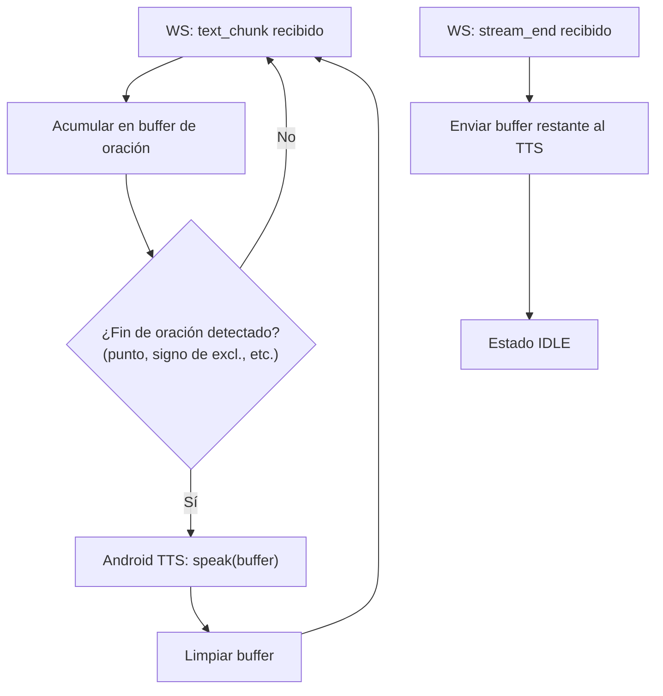
```mermaid
flowchart TD
    WS[WS: text_chunk recibido] --> BUFFER[Acumular en buffer de oración]
    BUFFER --> CHECK{"¿Fin de oración detectado?\n(punto, signo de excl., etc.)"}
    CHECK -->|No| WS
    CHECK -->|Sí| TTS["Android TTS: speak(buffer)"]
    TTS --> CLEAR[Limpiar buffer]
    CLEAR --> WS

    WS2[WS: stream_end recibido] --> FLUSH[Enviar buffer restante al TTS]
    FLUSH --> IDLE[Estado IDLE]
```

### 4.9 Cliente WebSocket (Comunicación Streaming con Backend)

#### Configuración

```
URL: wss://192.168.2.200:9393/ws/interact (WebSocket sobre TLS, gestionado por Nginx)
Ping Interval: 30s
Reconnect Policy: Backoff exponencial (1s, 2s, 4s, 8s, máx 30s)
Certificate Pinning: Habilitado (fingerprint del cert del servidor)
Headers:
  - X-API-Key: <clave-configurada> (en handshake)
  - User-Agent: RobotAndroid/1.4
```

#### API REST Auxiliar (para operaciones no-streaming)

```
Base URL: https://192.168.2.200:9393 (HTTPS obligatorio, vía Nginx)
Uso: Health checks, gestión de usuarios
Timeout Conexión: 10s
Timeout Lectura: 30s
Certificate Pinning: Habilitado
```

#### Manejo de Mensajes WebSocket

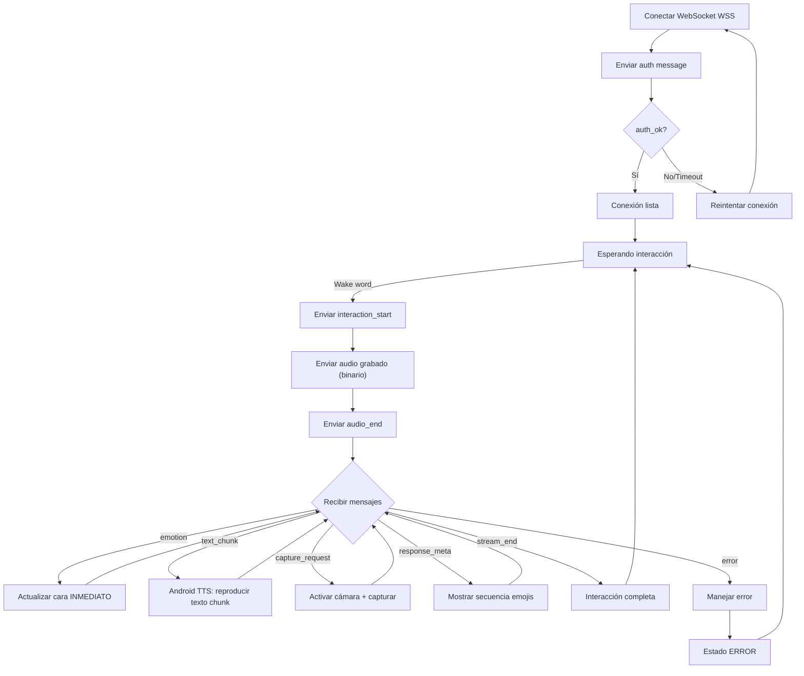
```mermaid
flowchart TD
    CONNECT[Conectar WebSocket WSS] --> AUTH[Enviar auth message]
    AUTH --> WAIT_AUTH{auth_ok?}
    
    WAIT_AUTH -->|Sí| READY[Conexión lista]
    WAIT_AUTH -->|No/Timeout| RETRY[Reintentar conexión]
    RETRY --> CONNECT
    
    READY --> IDLE[Esperando interacción]
    
    IDLE -->|Wake word| SEND_START[Enviar interaction_start]
    SEND_START --> STREAM_AUDIO["Enviar audio grabado (binario)"]
    STREAM_AUDIO --> SEND_END[Enviar audio_end]
    
    SEND_END --> RECV{Recibir mensajes}
    
    RECV -->|emotion| UPDATE_FACE[Actualizar cara INMEDIATO]
    RECV -->|text_chunk| SPEAK[Android TTS: reproducir texto chunk]
    RECV -->|capture_request| CAPTURE[Activar cámara + capturar]
    RECV -->|response_meta| SHOW_EMOJIS[Mostrar secuencia emojis]
    RECV -->|stream_end| COMPLETE[Interacción completa]
    RECV -->|error| HANDLE_ERROR[Manejar error]
    
    UPDATE_FACE --> RECV
    SPEAK --> RECV
    CAPTURE --> RECV
    SHOW_EMOJIS --> RECV
    COMPLETE --> IDLE
    
    HANDLE_ERROR --> ERROR_STATE[Estado ERROR]
    ERROR_STATE --> IDLE
```

#### Manejo de Desconexión WebSocket

```
Desconexión detectada:
1. Marcar estado como OFFLINE
2. Mostrar banner "Backend no disponible"
3. Iniciar reconesión automática con backoff
4. Si reconecta: enviar auth, restaurar estado IDLE
5. Wake word sigue activo durante desconexión
   (audio se graba y envía cuando reconecte)
```

### 4.10 Gestión de Expresiones Visuales

#### Diseño de Interfaz (Landscape, Tema Oscuro)

La aplicación tiene un diseño fijo en orientación **landscape (horizontal)**, bloqueado para que nunca rote a vertical. El fondo es negro puro (tema oscuro). Solo se muestran dos elementos principales:

```
Layout en landscape (pantalla completa):
┌────────────────────────────────────────────────────────────┐
│ 🔋10% 🤖  [superior izq — solo si batería robot ≤15%]    [bat. celular ⚡85%]  │
│                                                            │
│                                                            │
│              [EMOJI — 80% de la pantalla]                  │
│                 centrado vertical y horizontal              │
│                    con animación                           │
│                                                            │
│                                                            │
│        [texto del robot — 10% de altura inferior]          │
│     azul claro metalizado · solo ayuda / subtítulo         │
└────────────────────────────────────────────────────────────┘

Indicadores de batería (parpadeantes lentos, pequeños, no intrusivos):
- Batería robot (ESP32 telemetría) ≤15%: esquina superior izquierda
    → Icono rojo 🔋 + icono robot 🤖 + porcentaje restante, titilando lento
    → No se muestra si batería > 15%
- Batería del celular: esquina superior derecha
    → Icono naranja claro ⚡ + porcentaje, titilando lento
    → Se muestra siempre (actualizado desde BatteryManager del sistema)

No hay botones de control en pantalla. El robot solo se controla por voz.
```

#### Colores y Estilos

```
Fondo: #000000 (negro puro)
Texto de respuesta: #88CCEE o similar azul claro metalizado
  → Fuente: monospace o sans-serif medium, tamaño legible en landscape
Emoji: Imágenes OpenMoji cargadas desde CDN, tamaño máximo en su contenedor 80%
Indicador batería robot: #FF3333 (rojo vivo), opacidad pulsante 0.4→1.0
Indicador batería celular: #FFAA44 (naranja claro), opacidad pulsante 0.4→1.0
```

#### Transición Inmediata al Detectar Wake Word

El robot debe cambiar su expresión visual **al instante** de detectar el wake word, sin esperar a que el audio se grabe completo. Esto gestiona las expectativas del usuario: incluso si hay un pequeño delay de red, el usuario ve al robot reaccionar y eso es mucho más tolerable que una mirada en blanco.

#### Estados Visuales

```
IDLE (Reposo):
  Emoji: 🤖 (1F916)
  Animación: Parpadeo suave cada 3-5s
  Transición: Ninguna

LISTENING (Escuchando) [Transición INMEDIATA al wake word]:
  Emoji: 👂 (1F442)
  Animación: Pulso suave (escala 1.0 → 1.1 → 1.0)
  Indicador: Onda de audio visual (sutil, en texto inferior)

SEARCHING (Buscando persona con cámara frontal):
  Emoji: 🔍 (1F50D)
  Animación: Rotación lenta del emoji (simulando escaneo)
  Duración: Hasta rostro detectado o timeout PERSON_SEARCH_TIMEOUT_MS (8s)
  Nota: El robot físicamente rota ±90° y se mueve buscando a la persona

GREETING (Saludando a usuario reconocido):
  Emoji: 👋 (1F44B) → luego emotion tag del LLM (greeting)
  Animación: Wave + bounce entrada
  Transición: Inmediata al recibir emotion tag del backend

REGISTERING (Registrando nueva persona):
  Emoji: ❓ (2753)
  Animación: Pulso suave
  Duración: Hasta completar registro

THINKING (Procesando):
  Emoji: 🤔 (1F914)
  Animación: Rotación suave del emoji
  Indicador: Texto inferior "Pensando..."

EMOTION (Emoción recibida del LLM vía WebSocket):
  Emoji: Según emotion tag (ver mapeo en sección 3.9)
  Transición: Se muestra ANTES de que el TTS empiece a hablar
  Duración: Hasta que termina la reproducción del TTS
  Sincronización: La cara siempre coincide con la intención de la respuesta
  Texto inferior: texto de respuesta (subtítulos en azul claro metalizado)

RESPONDING (Respondiendo con secuencia de emojis):
  Secuencia: Hasta 3 emojis contextuales (de response_meta)
  Duración: 2s por emoji (configurable)
  Transición: fade | slide | bounce
  Audio: Android TTS sintetiza en tiempo real a medida que llegan text_chunks
  Texto inferior: texto de respuesta en rolling (últimas palabras), azul metalizado

MOVING (Ejecutando secuencia de movimientos del robot):
  Emoji: El indicado en emotion_during del move_sequence
  Duración: Sincronizado con total_duration_ms de la secuencia completa
  Texto inferior: Descripción de la acción ("Rotando hacia la derecha...")

ERROR (Error):
  Emoji: 😕 (1F615)
  Animación: Shake
  Duración: 2s → vuelve a IDLE

DISCONNECTED (Cerebro desconectado):
  Emoji: 🔌 (1F50C)
  Animación: Parpadeo lento
  Duración: Hasta reconexión
```

#### Implementación de Animaciones (Streaming)

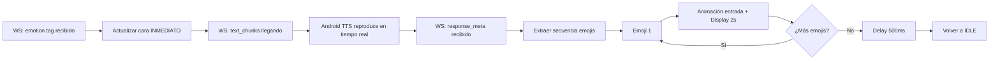
```mermaid
graph LR
    A[WS: emotion tag recibido] --> B[Actualizar cara INMEDIATO]
    B --> C[WS: text_chunks llegando]
    C --> D[Android TTS reproduce en tiempo real]
    D --> E[WS: response_meta recibido]
    E --> F[Extraer secuencia emojis]
    F --> G[Emoji 1]
    G --> H[Animación entrada + Display 2s]
    H --> I{¿Más emojis?}
    I -->|Sí| G
    I -->|No| J[Delay 500ms]
    J --> K[Volver a IDLE]
```

#### Emojis OpenMoji: estrategia de carga

Los emojis de OpenMoji **no requieren descarga previa en archivo ZIP**. El LLM ya conoce todos los códigos Unicode de los emojis que necesita usar, y Android descarga los archivos SVG directamente desde el CDN de OpenMoji (`https://openmoji.org/data/color/svg/<HEXCODE>.svg`) en tiempo real. Solo se pre-cargan en caché local los 20 emojis más frecuentes (estados fijos y emociones más comunes) al iniciar la app. El resto se descargan y cachean automáticamente la primera vez que se necesitan.

```
Pre-carga inicial (20 emojis más usados):
  Estados: 1F916, 1F442, 1F914, 1F615, 1F50C, 1F50D, 1F44B, 2753
  Emociones: 1F600, 1F603, 1F622, 1F97A, 1F632, 2764-FE0F, 1F60E, 1F44D
  Estrategia caché: LRU, máximo 50MB, directorio /cache/openmoji/
CDN base: https://openmoji.org/data/color/svg/
Backend no necesita los archivos de emojis — solo envía códigos hexadecimales.
```

### 4.11 Gestor de Bluetooth (Comunicación con ESP32)

#### Protocolo de Comunicación

```
Transport: Bluetooth Low Energy (BLE)
Service UUID: 6E400001-B5A3-F393-E0A9-E50E24DCCA9E (Nordic UART Service)
TX Characteristic: 6E400002-B5A3-F393-E0A9-E50E24DCCA9E (Write)
RX Characteristic: 6E400003-B5A3-F393-E0A9-E50E24DCCA9E (Notify)

Formato de mensajes: JSON UTF-8
MTU: 512 bytes
```

#### Comandos Bluetooth

```json
// Heartbeat (enviado cada 1 segundo)
{
  "type": "heartbeat",
  "timestamp": 1234567890
}

// Movimiento
{
  "type": "move",
  "direction": "forward|backward|left|right|stop",
  "speed": 0-100,
  "duration": milliseconds
}

// Control de luces
{
  "type": "light",
  "action": "on|off|blink",
  "color": "red|green|blue|white|rgb(r,g,b)",
  "intensity": 0-100
}

// Solicitar telemetría
{
  "type": "telemetry",
  "request": "sensors|battery|status"
}
```

#### Respuestas del ESP32

```json
// Confirmación de comando
{
  "status": "ok|error",
  "command_id": "uuid",
  "error_msg": "descripción si hay error"
}

// Telemetría de sensores
{
  "type": "telemetry",
  "battery": 75,
  "sensors": {
    "distance_front": 150,
    "distance_rear": 200,
    "cliff_detected": false,
    "light_level": 300
  },
  "timestamp": 1234567890
}
```

### 4.12 Gestión de Permisos

#### Permisos Requeridos

```
REQUIRED (runtime):
- RECORD_AUDIO: Grabación de voz
- CAMERA: Captura de imágenes/video
- BLUETOOTH: Conexión con ESP32
- BLUETOOTH_CONNECT: Android 12+
- BLUETOOTH_SCAN: Android 12+

OPTIONAL:
- FOREGROUND_SERVICE: Servicio persistente
- WAKE_LOCK: Mantener CPU para wake word
- INTERNET: Comunicación con backend
```

#### Flujo de Solicitud

```mermaid
sequenceDiagram
    participant A as App
    participant S as Sistema Android
    participant U as Usuario
    
    A->>S: Solicitar RECORD_AUDIO
    S->>U: Dialog de permiso
    U->>S: Conceder/Denegar
    
    alt Permiso concedido
        S->>A: Permission Granted
        A->>A: Continuar setup
    else Permiso denegado
        S->>A: Permission Denied
        A->>U: Explicar necesidad del permiso
        A->>A: Botón para abrir Settings
    end
```

### 4.13 Persistencia Local

#### Datos Almacenados

```
EncryptedSharedPreferences (Android Keystore):
- api_key: String (encriptado)
- backend_url: String
- server_cert_fingerprint: String (para certificate pinning)
- user_id_default: String
- wake_word_sensitivity: Float
- face_recognition_threshold: Float (default: 0.70) // Umbral ML Kit on-device (Android)
- face_search_timeout_ms: Int (default: 8000)       // PERSON_SEARCH_TIMEOUT_MS
- emoji_cache_enabled: Boolean
- bluetooth_device_mac: String
- last_sync: Long (timestamp)
- tts_language: String (default: "es") // Idioma del TTS
- tts_voice_name: String (default: "") // Voz del sistema (vacío = default del sistema)
- tts_speech_rate: Float (default: 0.9) // Velocidad de habla
- tts_pitch: Float (default: 1.0)       // Tono de la voz

Room Database Local (face_embeddings.db):
- Tabla: face_embeddings (user_id, name, embedding BLOB 128D, created_at, last_seen)
- Ubicación: /data/data/com.robot/databases/face_embeddings.db
- Propósito: Reconocimiento facial on-device sin conexión al backend
- Sincronización: Se sincroniza con el backend al registrar un nuevo usuario

Cache de Emojis:
- Directorio: /data/data/com.robot/cache/openmoji/
- Formato: SVG files (*.svg)
- Tamaño máximo: 50MB
- Estrategia: LRU (Least Recently Used)
- Pre-carga: 20 emojis más comunes
```

### 4.14 Configuración de Compilación

```
minSdkVersion: 24 (Android 7.0)
targetSdkVersion: 33 (Android 13)
compileSdkVersion: 33

Optimizaciones:
- R8/ProGuard: Habilitado
- Multidex: Habilitado
- ViewBinding: Habilitado
- Coroutines: Para operaciones async

Dependencias principales:
- Kotlin Coroutines
- OkHttp (WebSocket client + Certificate Pinning)
- Retrofit + OkHttp (REST auxiliar)
- Coil (carga de imágenes/SVG)
- Porcupine (wake word: hey_moji_wake.ppn)
- AndroidX (Lifecycle, WorkManager)
- EncryptedSharedPreferences (seguridad)
- CameraX (captura de frames para reconocimiento facial + foto/video por comando)
- ML Kit Face Detection (com.google.mlkit:face-detection:16.x)
- TensorFlow Lite (com.google.ai.edge.litert:litert:1.x)
- Room Database (SQLite local para embeddings faciales)
- Modelo TFLite: facenet.tflite (~20MB, incluido en assets/)
- Android TextToSpeech (API del sistema, sin dependencia externa)
  Nota: No se requieren librerías adicionales; TextToSpeech está incluido
  en android.speech.tts desde API level 4. La voz disponible depende
  del motor TTS instalado en el dispositivo (Google TTS, Samsung TTS, etc.).
```

---

## 5. Componente: ESP32 (Control Físico)

### 5.1 Arquitectura del Firmware

```mermaid
graph TB
    subgraph "Hardware Layer"
        MOTOR[Driver Motores<br/>L298N Dual H-Bridge<br/>Gear Motor TT Yellow 5V]
        SENS_CLIFF[Sensores Cliff<br/>VL53L0X ToF x3]
        SENS_DIST_F[Sensor Distancia Frontal<br/>HC-SR04]
        SENS_DIST_R[Sensor Distancia Trasero<br/>HC-SR04]
        RGB_LED[RGB LED<br/>4 patas, 256 colores]
        BATT[Monitor Batería<br/>Pack 3S2P 11.1V]
    end
    
    subgraph "Firmware Layer"
        MAIN[main.cpp<br/>Loop Principal]
        BT_SERVER[BLE Server]
        MOTOR_CTRL[Motor Controller<br/>2 ruedas + rueda libre]
        SENSOR_MGR[Sensor Manager<br/>Detención a menos de 10cm]
        LED_CTRL[LED Controller<br/>RGB LED simple]
        SAFETY[Safety Monitor<br/>Obstáculos < 10cm → STOP]
    end
    
    subgraph "Communication"
        BLE[BLE UART Service]
        JSON[JSON Parser/Builder]
    end
    
    BLE --> BT_SERVER
    BT_SERVER --> JSON
    JSON --> MAIN
    
    MAIN --> MOTOR_CTRL
    MAIN --> LED_CTRL
    MAIN --> SENSOR_MGR
    
    SENSOR_MGR --> SAFETY
    SAFETY --> MOTOR_CTRL
    
    MOTOR_CTRL --> MOTOR
    LED_CTRL --> RGB_LED
    SENSOR_MGR --> SENS_CLIFF
    SENSOR_MGR --> SENS_DIST_F
    SENSOR_MGR --> SENS_DIST_R
    SENSOR_MGR --> BATT
    
    SENSOR_MGR --> JSON
    JSON --> BT_SERVER
    BT_SERVER --> BLE
```

### 5.2 Estructura del Proyecto

```
esp32-firmware/
├── platformio.ini
├── src/
│   ├── main.cpp
│   ├── config.h
│   ├── bluetooth/
│   │   ├── BLEServer.cpp
│   │   ├── BLEServer.h
│   │   ├── HeartbeatMonitor.cpp    # Monitor de heartbeat con timeout 3s
│   │   └── HeartbeatMonitor.h
│   ├── motors/
│   │   ├── MotorController.cpp     # L298N + Gear Motor TT Yellow 5V
│   │   └── MotorController.h
│   ├── sensors/
│   │   ├── CliffSensor.cpp         # VL53L0X ToF x3 (precisa medición de distancia)
│   │   ├── CliffSensor.h
│   │   ├── DistanceSensor.cpp      # HC-SR04 x2 (frontal y trasero)
│   │   ├── DistanceSensor.h
│   │   └── BatteryMonitor.cpp      # Pack 6x18650 3S2P, 11.1V nominal
│   ├── leds/
│   │   ├── LEDController.cpp       # RGB LED simple 4 patas, 256 colores
│   │   └── LEDController.h
│   ├── safety/
│   │   ├── SafetyMonitor.cpp       # Detención automática a < 10cm de obstáculo
│   │   └── SafetyMonitor.h
│   └── utils/
│       ├── JSONParser.cpp
│       └── Logger.cpp
└── lib/
    ├── ArduinoJson/
    ├── VL53L0X/                    # Librería para sensores cliff ToF
    └── ESP32-BLE-Arduino/
```

### 5.3 Configuración de Hardware

#### Pinout ESP32-S3 WROOM (Freenove FNK0082)

> **Pines reservados ESP32-S3 — NO usar**: GPIO 0, 3, 45, 46 (strapping); GPIO 19, 20 (USB);
> GPIO 35, 36, 37 (OPI PSRAM). Los pines de cámara (GPIO 4–18) son de uso libre ya que el
> ESP32-S3 no lleva módulo de cámara en este proyecto.

```
Motores — L298N Dual H-Bridge (Gear Motor TT Yellow 5V):
- Motor Izquierdo FWD:  GPIO 41  (IN1 del L298N)
- Motor Izquierdo REV:  GPIO 42  (IN2 del L298N)
- Motor Derecho FWD:    GPIO 47  (IN3 del L298N)
- Motor Derecho REV:    GPIO 48  (IN4 del L298N)
- Enable A (Izq):       GPIO 1   (ENA, PWM)
- Enable B (Der):       GPIO 2   (ENB, PWM)
  — Configuración física: 2 ruedas motrices + 1 rueda de apoyo —

Sensores de Cliff — VL53L0X ToF x3 (I²C):
- SDA compartido:       GPIO 21
- SCL compartido:       GPIO 22
- XSHUT Cliff F-Izq:   GPIO 11  (reset para dirección única I²C)
- XSHUT Cliff F-Der:   GPIO 12
- XSHUT Cliff Trasero: GPIO 13

Sensor de Distancia FRONTAL — HC-SR04:
- Trigger: GPIO 4
- Echo:    GPIO 5

Sensor de Distancia TRASERO — HC-SR04:
- Trigger: GPIO 6
- Echo:    GPIO 7

RGB LED simple (4 patas, ánodo común, 256 colores por canal → ~16M colores):
- Canal R:  GPIO 38  (PWM — LEDC canal 0)
- Canal G:  GPIO 39  (PWM — LEDC canal 1)
- Canal B:  GPIO 40  (PWM — LEDC canal 2)
- Ánodo (+): 3.3V  (pata larga — ánodo común)
  Nota: nivel LOW = LED encendido; usar ledcWrite(pin, 255 - valor)

Batería:
- Voltaje ADC:  GPIO 8   (divisor resistivo para medir pack 3S2P, ADC1_CH7)
```

> **Nota de pines**: Todos los conflictos de la revisión anterior han sido resueltos con esta
> asignación. La selección evita los pines reservados del ESP32-S3 (USB, PSRAM, strapping).
> Los GPIOs 38/39/40 (interfaz SD card) se usan para el RGB LED dado que no se emplea SD card.

#### Especificaciones Eléctricas

```
Alimentación — Pack 6x 18650 en 3S2P:
- Configuración: 3S2P → 3 celdas en serie × 2 en paralelo
- Tensión nominal: 11.1V (3.7V × 3S)
- Tensión máxima (cargado): 12.6V (4.2V × 3S)
- Tensión mínima (protección BMS): ~9.0V (3.0V × 3S)
- Capacidad total: 2 × capacidad de celda (p.ej. 2 × 3000mAh = 6000mAh)
- BMS: 3S 20A para Li-ion 18650 (protección de sobrecarga, sobredescarga, cortocircuito)

Regulación de voltaje — 2 Buck Converters:
- Buck Converter #1 (Motores): 9–12.6V → 5.0V
    Salida: alimenta L298N y Gear Motor TT Yellow
- Buck Converter #2 (ESP32 + sensores): 9–12.6V → 5.0V
    Entrada al pin VIN del ESP32
    Regulador interno ESP32: 5V → 3.3V (para lógica + VL53L0X + HC-SR04)

Motores:
- Tipo: Gear Motor TT Yellow for Arduino Robotic Car
- Tensión de operación: 5V (recomendado)
- Corriente: ~200mA por motor (sin carga)
- Driver: L298N Dual H-Bridge (SOLO L298N — no DRV8833)
- PWM Frecuencia: 1kHz
- Número de ruedas: 2 ruedas motrices + 1 rueda de apoyo (soporte)

Consumo Total (estimado):
- ESP32:        ~100mA (BT activo)
- Motores:      ~400mA (en movimiento)
- RGB LED:      ~30mA (brillo máximo, 3 canales × 10mA típico)
- Sensores:     ~80mA (2× HC-SR04 + 3× VL53L0X)
- TOTAL pico:   ~610mA (desde Buck #2) + ~400mA (Buck #1 motores)
```

### 5.4 Protocolo BLE

#### Configuración del Servicio

```
Device Name: "RobotESP32"
Service UUID: 6E400001-B5A3-F393-E0A9-E50E24DCCA9E

Características:
1. TX (Write): Recibe comandos desde Android
   UUID: 6E400002-B5A3-F393-E0A9-E50E24DCCA9E
   Properties: WRITE, WRITE_NO_RESPONSE
   Max Length: 512 bytes

2. RX (Notify): Envía telemetría a Android
   UUID: 6E400003-B5A3-F393-E0A9-E50E24DCCA9E
   Properties: NOTIFY
   Interval: Cada 1 segundo (o on-demand)
```

#### Máquina de Estados de Conexión

```mermaid
stateDiagram-v2
    [*] --> Advertising
    Advertising --> Connected: Cliente conecta
    Connected --> Advertising: Cliente desconecta
    
    state Connected {
        [*] --> Idle
        Idle --> Executing: Comando recibido
        Executing --> Idle: Comando completo
        Executing --> Emergency: Sensor de emergencia
        Executing --> BrainOffline: Heartbeat perdido >3s
        Emergency --> Idle: Emergencia resuelta
        
        Idle --> Sending: Intervalo telemetría
        Sending --> Idle: Datos enviados
        
        Idle --> BrainOffline: Heartbeat perdido >3s
        BrainOffline --> Idle: Heartbeat restaurado
    }
    
    state BrainOffline {
        [*] --> MotorStop: STOP inmediato
        MotorStop --> AmberPulse: LEDs ámbar pulsante
        AmberPulse --> WaitHeartbeat: Esperar heartbeat
        WaitHeartbeat --> AmberPulse: Cada 500ms
    }
    
    Connected --> [*]: Reinicio
```

#### Protocolo de Heartbeat

El dispositivo Android envía un mensaje heartbeat cada 1 segundo a través de BLE. Si el ESP32 no recibe un heartbeat durante 3 segundos, entra automáticamente en estado **BRAIN_OFFLINE** y ejecuta el protocolo de seguridad independiente:

```
Heartbeat Protocol:
- Frecuencia: Cada 1 segundo (Android → ESP32)
- Formato: {"type": "heartbeat", "timestamp": unix_ms}
- Timeout: 3 segundos sin heartbeat → BRAIN_OFFLINE
- Acción en BRAIN_OFFLINE:
  1. STOP inmediato de todos los motores
  2. LEDs en modo ámbar pulsante (código visual de error)
  3. Enviar telemetría de emergencia si BLE aún conectado
  4. No aceptar nuevos comandos de movimiento
- Recuperación: Al recibir heartbeat válido → volver a Idle
- Propósito: El cuerpo del robot puede salvarse a sí mismo
  si el cerebro (Android) muere, independiente de la app
```

Este mecanismo desacopla la seguridad física de la lógica de alto nivel de la app. Si el OS Android mata el servicio, o si la app se cuelga durante un movimiento, el robot se detiene automáticamente y muestra visualmente que su "cerebro" está desconectado.

### 5.5 Control de Motores

> **Configuración física**: 2 ruedas motrices (izquierda + derecha, Gear Motor TT Yellow 5V vía L298N)
> + 1 rueda de apoyo delantera (rueda loca/caster). Giro realizado diferencialmente.

#### Modos de Movimiento

```
Forward (Adelante):
  - Motor Izq: PWM speed% FWD
  - Motor Der: PWM speed% FWD
  — 2 ruedas motrices avanzan; rueda de apoyo sigue pasivamente —

Backward (Atrás):
  - Motor Izq: PWM speed% REV
  - Motor Der: PWM speed% REV
  — Sensor trasero HC-SR04 activo; el sistema de seguridad detiene si < 10cm —

Left / Rotate-Left (Izquierda / Rotar a la izquierda):
  - Motor Izq: PWM speed% REV
  - Motor Der: PWM speed% FWD
  — Giro diferencial sobre la rueda de apoyo —

Right / Rotate-Right (Derecha / Rotar a la derecha):
  - Motor Izq: PWM speed% FWD
  - Motor Der: PWM speed% REV

Stop (Parar):
  - Ambos motores: PWM 0%
  - Freno activo (ambos pines LOW)

Search-Rotate (Búsqueda de persona):
  - Secuencia enviada desde Android cuando el robot busca a la persona
  - Ejemplo: Rotar +90°, esperar, Rotar -90°, avanzar, retroceder
  - Comando BLE tipo: move_sequence (ver 5.4)

Move-Sequence (Secuencia de movimiento):
  - El backend calcula una secuencia de pasos con duración total
  - Android envía el array de steps al ESP32 vía BLE
  - ESP32 ejecuta cada step en orden y sincroniza emojis con total_duration_ms
  - Formato step: {"direction": "forward", "speed": 70, "duration_ms": 800}
```

#### Tipos de Comandos BLE (TX desde Android)

```json
// Comando simple de movimiento
{"type": "move", "direction": "forward", "speed": 70}

// Secuencia de movimientos (para búsqueda o respuesta a usuario)
{
  "type": "move_sequence",
  "total_duration_ms": 2400,
  "steps": [
    {"direction": "rotate_right", "speed": 50, "duration_ms": 800},
    {"direction": "stop",         "speed": 0,  "duration_ms": 400},
    {"direction": "rotate_left",  "speed": 50, "duration_ms": 800},
    {"direction": "stop",         "speed": 0,  "duration_ms": 400}
  ]
}

// Stop inmediato
{"type": "stop"}
```

#### Sistema de Rampa (Suavizado)

```mermaid
flowchart LR
    A[Comando Move] --> B[Speed Objetivo]
    B --> C{¿Speed actual?}
    C --> D[Incrementar/Decrementar<br/>en pasos de 10%]
    D --> E[Aplicar PWM]
    E --> F{¿Objetivo alcanzado?}
    F -->|No| D
    F -->|Sí| G[Mantener velocidad]
```

### 5.6 Sistema de Seguridad

#### Monitor de Seguridad Continuo

```mermaid
flowchart TD
    START[Loop Principal] --> CHECK_HB[Verificar heartbeat]
    CHECK_HB --> HB_OK{¿Heartbeat recibido<br/>en últimos 3s?}
    
    HB_OK -->|No| BRAIN_OFFLINE[BRAIN_OFFLINE:<br/>STOP motores +<br/>LEDs ámbar pulsante]
    HB_OK -->|Sí| CHECK_CLIFF[Leer sensores cliff]
    
    CHECK_CLIFF --> CLIFF_OK{¿Cliff detectado?}
    
    CLIFF_OK -->|Sí| EMERGENCY[STOP INMEDIATO]
    CLIFF_OK -->|No| CHECK_DIST[Leer sensor distancia]
    
    CHECK_DIST --> DIST_OK{¿Distancia FRONTAL < 10cm?}
    DIST_OK -->|Sí y Avanzando| EMERGENCY
    DIST_OK -->|No| CHECK_DIST_R[Leer sensor distancia TRASERO]

    CHECK_DIST_R --> DIST_R_OK{¿Distancia TRASERA < 10cm?}
    DIST_R_OK -->|Sí y Retrocediendo| EMERGENCY
    DIST_R_OK -->|No| CHECK_BATT[Leer batería]
    
    CHECK_BATT --> BATT_OK{¿Batería < 10%?}
    BATT_OK -->|Sí| LOW_BATT[Notificar batería baja]
    BATT_OK -->|No| NORMAL[Operación normal]
    
    EMERGENCY --> NOTIFY[Enviar telemetría emergencia]
    NOTIFY --> WAIT[Esperar intervención]
    
    LOW_BATT --> NORMAL
    NORMAL --> START
    WAIT --> START
```

#### Condiciones de Emergencia

```
Prioridad CRÍTICA:
1. Cliff detectado (cualquier sensor)
   → STOP inmediato + notificar

2. Distancia frontal < 10cm durante movimiento adelante
   → STOP inmediato + notificar

2b. Distancia trasera < 10cm durante movimiento atrás
   → STOP inmediato + notificar

3. Pérdida de heartbeat BLE > 3s (BRAIN_OFFLINE)
   → STOP inmediato + LEDs ámbar pulsante
   → El robot se auto-protege si el Android muere
   → Feedback visual independiente de la app

4. Pérdida de comunicación BLE completa durante movimiento
   → STOP inmediato + modo seguro

Prioridad ALTA:
5. Batería < 10%
   → Notificar + limitar velocidad al 50%

6. Timeout de comando > duración especificada
   → STOP gradual + idle
```

### 5.7 Control de LEDs

> **Hardware**: RGB LED simple de 4 patas (**ánodo común** — pata larga conectada a 3.3V).  
> Control por PWM con `ledcAttachChannel()` + `ledcWrite()` (API Arduino ESP32 2.x).  
> No se usa WS2812B ni FastLED — control directo con `ledcWrite` del ESP32-S3.  
> **Ánodo común**: nivel LOW = LED encendido → se usa `255 - valor` para lógica intuitiva (0 = apagado, 255 = máximo brillo).

#### Modos de Iluminación

```
Estado IDLE:
  - Color: Azul suave (R=0, G=80, B=200)
  - Patrón: Respiración (PWM fade in/out en los 3 canales)
  - Velocidad: Lenta (ciclo ~3s)

Estado MOVING:
  - Color: Verde (R=0, G=255, B=0)
  - Patrón: Sólido
  - Intensidad: 80%

Estado ERROR:
  - Color: Rojo (R=255, G=0, B=0)
  - Patrón: Parpadeo rápido
  - Frecuencia: 2 Hz

Estado BRAIN_OFFLINE (Heartbeat perdido):
  - Color: Ámbar (R=255, G=160, B=0)
  - Patrón: Pulso suave (fade in/out)
  - Frecuencia: 1 Hz
  - Propósito: Código visual independiente de la app

Estado LOW BATTERY:
  - Color: Naranja (R=255, G=100, B=0)
  - Patrón: Parpadeo lento
  - Frecuencia: 0.5 Hz

Modo Custom (comando BLE):
  - Color: RGB personalizado (valores 0-255 por canal)
  - Patrón: Sólido | Blink | Breathe
  - No hay efecto Rainbow (limitación del LED simple)
```

#### Implementación de Efectos (ledcWrite PWM)

```mermaid
flowchart TD
    A[Comando LED recibido] --> B{Tipo de patrón}
    
    B -->|Solid| C[ledcWrite R/G/B con valores fijos]
    B -->|Blink| D[Toggle ON/OFF cada 500ms<br/>ledcWrite valor ↔ 0]
    B -->|Breathe| E[Fade PWM 0→255→0<br/>en los 3 canales proporcionalmente]
    
    C --> F[ESP32 aplica PWM directo]
    D --> F
    E --> F
```

```cpp
// Inicialización — asociar pines a canales LEDC (1 kHz, 8 bits, como ejemplo Freenove)
void setupLED() {
  ledcAttachChannel(LED_PIN_R, LED_PWM_FREQ, 8, LED_PWM_CHANNEL_R);
  ledcAttachChannel(LED_PIN_G, LED_PWM_FREQ, 8, LED_PWM_CHANNEL_G);
  ledcAttachChannel(LED_PIN_B, LED_PWM_FREQ, 8, LED_PWM_CHANNEL_B);
}

// Control de color — ánodo común: nivel bajo = encendido → invertir valores
void setLED(uint8_t r, uint8_t g, uint8_t b) {
  ledcWrite(LED_PIN_R, 255 - r);  // 0 = apagado, 255 = brillo máximo (lógica usuario)
  ledcWrite(LED_PIN_G, 255 - g);
  ledcWrite(LED_PIN_B, 255 - b);
}
```

### 5.8 Telemetría y Logging

#### Datos de Telemetría

```json
{
  "type": "telemetry",
  "timestamp": 1234567890,
  "battery": {
    "voltage": 7.2,
    "percentage": 75,
    "charging": false
  },
  "sensors": {
    "cliff_front_left": false,
    "cliff_front_right": false,
    "cliff_rear": false,
    "distance_front": 150,
    "light_level": 300
  },
  "motors": {
    "left_speed": 50,
    "right_speed": 50,
    "direction": "forward"
  },
  "leds": {
    "mode": "moving",
    "color": [0, 255, 0]
  },
  "uptime": 3600,
  "free_heap": 120000,
  "heartbeat": {
    "last_received_ms": 1234567890,
    "brain_online": true
  }
}
```

#### Envío de Telemetría

```
Modo periódico: Cada 1 segundo (si conectado)
Modo on-demand: Al recibir comando "telemetry"
Modo emergencia: Inmediato al detectar condición crítica
```

### 5.9 Configuración del Firmware

```cpp
// config.h

// Bluetooth
#define BLE_DEVICE_NAME "RobotESP32"
#define BLE_MTU_SIZE 512

// Motores
#define MOTOR_PWM_FREQ 1000
#define MOTOR_PWM_RESOLUTION 8
#define MOTOR_RAMP_STEP 10
#define MOTOR_RAMP_DELAY_MS 50

// Seguridad
#define CLIFF_CHECK_INTERVAL_MS 100
#define DISTANCE_THRESHOLD_CM 10         // Obstáculo frontal o trasero < 10cm → STOP
#define LOW_BATTERY_THRESHOLD 10
#define BLE_TIMEOUT_MS 10000
#define HEARTBEAT_TIMEOUT_MS 3000        // 3s sin heartbeat = BRAIN_OFFLINE
#define HEARTBEAT_EXPECTED_INTERVAL 1000 // Esperar heartbeat cada 1s

// Motores — Gear Motor TT Yellow 5V vía L298N
#define MOTOR_IN1  41                    // Motor Izquierdo FWD
#define MOTOR_IN2  42                    // Motor Izquierdo REV
#define MOTOR_IN3  47                    // Motor Derecho FWD
#define MOTOR_IN4  48                    // Motor Derecho REV
#define MOTOR_ENA  1                     // Enable A (Izq) — PWM
#define MOTOR_ENB  2                     // Enable B (Der) — PWM

// Sensores Cliff — VL53L0X ToF x3 (I²C)
#define I2C_SDA         21
#define I2C_SCL         22
#define XSHUT_CLIFF_FL  11               // Cliff Front-Left
#define XSHUT_CLIFF_FR  12               // Cliff Front-Right
#define XSHUT_CLIFF_RR  13               // Cliff Rear

// Sensores HC-SR04 (frontal y trasero)
#define ULTRASONIC_TIMEOUT_US 30000
#define DIST_TRIG_FRONT 4
#define DIST_ECHO_FRONT 5
#define DIST_TRIG_REAR  6
#define DIST_ECHO_REAR  7

// Batería — Pack 6x 18650 3S2P
#define BATTERY_ADC_PIN  8               // ADC1_CH7 — divisor resistivo 3S2P
#define BATTERY_ADC_SAMPLES 10
#define BATTERY_VOLTAGE_MIN 9.0          // ~3.0V × 3S (BMS protege antes)
#define BATTERY_VOLTAGE_MAX 12.6         // 4.2V × 3S (carga completa)

// Motor — Gear Motor TT Yellow 5V via L298N
#define MOTOR_VOLTAGE_TARGET 5.0         // Buck Converter #1 → 5V

// RGB LED ánodo común, 4 patas (GPIO 38/39/40 — sin WS2812B / sin FastLED)
// Ánodo común: nivel LOW = encendido → setLED usa (255 - valor)
#define LED_PIN_R       38               // Canal rojo
#define LED_PIN_G       39               // Canal verde
#define LED_PIN_B       40               // Canal azul
#define LED_PWM_FREQ    1000             // 1 kHz (igual que ejemplo Freenove)
#define LED_PWM_CHANNEL_R 0
#define LED_PWM_CHANNEL_G 1
#define LED_PWM_CHANNEL_B 2
#define LED_BRIGHTNESS_MAX 255

// Telemetría
#define TELEMETRY_INTERVAL_MS 1000
```

---

## 6. Protocolos de Comunicación

### 6.1 Android ↔ Backend (WebSocket Streaming + REST Auxiliar)

#### Especificación del Protocolo Principal (WebSocket)

```
Protocolo: WebSocket sobre TLS (wss://)
Formato: JSON (mensajes de control) + Binary (audio del usuario)
Encoding: UTF-8 (JSON), Raw bytes (audio)
Autenticación: API Key en primer mensaje (handshake)
Certificate Pinning: Obligatorio en cliente Android

Mensajes del cliente (v2.0):
- auth: Autenticación con API Key
- interaction_start: Inicio de interacción (puede incluir face_embedding + person_id)
- binary: Audio grabado (AAC/WebM)
- audio_end: Fin de grabación
- text: Texto directo
- image: Imagen en base64
- video: Video en base64
- face_scan_mode: Solicitar escaneo facial 360°
- person_detected: Persona detectada con embedding
- battery_alert: Alerta de batería baja

Mensajes del servidor (v2.0):
- auth_ok: Confirmación de autenticación
- person_registered: Persona registrada/identificada
- face_scan_actions: Secuencia de giro + capturas
- emotion: Emoción del LLM (enviado primero)
- text_chunk: Fragmento de texto (streaming)
- capture_request: Solicitud de captura
- response_meta: Metadata (emojis + acciones ESP32 + person_name)
- low_battery_alert: Instrucción de ir a base de carga
- stream_end: Fin de streaming
- error: Error con código y mensaje

Keepalive:
- Ping/Pong: Cada 30 segundos
- Timeout: 10 segundos sin pong = reconectar
```

#### Protocolo REST Auxiliar (HTTPS)

```
Protocolo: HTTPS/1.1 (TLS obligatorio)
Formato: JSON
Encoding: UTF-8
Autenticación: API Key en header X-API-Key
Certificate Pinning: Obligatorio

Uso: Operaciones mínimas que no requieren streaming
```

#### Endpoints REST (v2.0)

```
GET /api/health
  → Health check del backend
  → Response: {"status": "ok", "version": "2.0", "uptime_s": 3600}

GET /api/restore
  → Descarga completa del estado persistido para restaurar Android
  → Response:
    {
      "people": [...],          // lista people con person_id, name, last_seen
      "face_embeddings": [...], // embeddings disponibles por persona
      "general_memories": [...]  // memorias globales de Moji (person_id=null)
    }
```

#### Formato de Errores Estandarizado

```json
{
  "error": true,
  "error_code": "ERROR_CODE_SNAKE_CASE",
  "message": "Mensaje legible para humanos",
  "details": "Información técnica adicional",
  "recoverable": true|false,
  "retry_after": 5,
  "timestamp": "2026-02-08T10:30:00Z",
  "request_id": "uuid-v4"
}
```

### 6.2 Android ↔ ESP32 (Bluetooth LE)

#### Especificación del Protocolo

```
Transport: Bluetooth Low Energy 4.0+
Profile: Custom (Nordic UART Service)
MTU: 512 bytes
Formato: JSON UTF-8
Frecuencia: On-demand + telemetría periódica 1Hz + heartbeat 1Hz
```

#### Estructura de Comandos

```json
{
  "id": "uuid-v4",
  "type": "move|light|telemetry|stop|heartbeat",
  "params": {
    // Parámetros específicos del comando
  },
  "timestamp": 1234567890
}
```

#### Estructura de Respuestas

```json
{
  "id": "uuid-v4-del-comando",
  "status": "ok|error|warning",
  "data": {
    // Datos de respuesta
  },
  "error_msg": "descripción si status=error",
  "timestamp": 1234567890
}
```

#### Manejo de Desconexión

```mermaid
sequenceDiagram
    participant A as Android
    participant E as ESP32
    
    Note over A,E: Conexión establecida
    
    A->>E: Comando
    E-->>A: ACK
    
    Note over A,E: Conexión perdida
    
    loop Reconexión
        A->>E: Intento de conexión
        Note over A: Espera 2s
    end
    
    E-->>A: Conexión restaurada
    A->>E: Solicitar estado actual
    E-->>A: Telemetría completa
    
    Note over A: Sincronizar estado UI
```

### 6.3 Códigos de Error Globales

```
Rango 1xxx: Errores de Autenticación
- 1001: API_KEY_MISSING
- 1002: API_KEY_INVALID
- 1003: API_KEY_EXPIRED

Rango 2xxx: Errores de Validación
- 2001: INVALID_REQUEST_FORMAT
- 2002: MISSING_REQUIRED_FIELD
- 2003: FILE_TOO_LARGE
- 2004: UNSUPPORTED_FILE_FORMAT

Rango 3xxx: Errores de Servicios Externos
- 3001: GEMINI_SERVICE_UNAVAILABLE
- 3002: GEMINI_RATE_LIMIT_EXCEEDED

Rango 4xxx: Errores de Datos
- 4001: USER_NOT_FOUND
- 4002: FACE_NOT_RECOGNIZED
- 4003: MEMORY_NOT_FOUND
- 4004: DATABASE_ERROR

Rango 5xxx: Errores de Sistema
- 5001: INTERNAL_SERVER_ERROR
- 5002: OUT_OF_MEMORY
- 5003: DISK_FULL
- 5004: CONFIGURATION_ERROR

Rango 6xxx: Errores de Bluetooth
- 6001: BLUETOOTH_NOT_ENABLED
- 6002: DEVICE_NOT_FOUND
- 6003: CONNECTION_FAILED
- 6004: COMMAND_TIMEOUT
- 6005: CHARACTERISTIC_NOT_FOUND

Rango 7xxx: Errores de Hardware (ESP32)
- 7001: CLIFF_DETECTED
- 7002: OBSTACLE_DETECTED
- 7003: LOW_BATTERY
- 7004: MOTOR_FAILURE
- 7005: SENSOR_MALFUNCTION
- 7006: HEARTBEAT_LOST (BRAIN_OFFLINE)

Rango 8xxx: Errores de WebSocket
- 8001: WS_AUTH_FAILED
- 8002: WS_CONNECTION_LOST
- 8003: WS_MESSAGE_TOO_LARGE
- 8004: WS_INVALID_MESSAGE_FORMAT
- 8005: WS_STREAM_INTERRUPTED
```

---

## 7. Gestión de Estados del Sistema

### 7.1 Estados Globales del Robot

```mermaid
stateDiagram-v2
    [*] --> BOOT
    BOOT --> IDLE: Inicialización OK
    BOOT --> ERROR: Fallo inicialización
    
    IDLE --> LISTENING: Wake Word [transición visual inmediata]
    LISTENING --> SEARCHING: Audio capturado + Cámara activada
    SEARCHING --> GREETING: Rostro reconocido (score > 0.70)
    SEARCHING --> REGISTERING: Rostro desconocido
    SEARCHING --> IDLE: Timeout 5s sin rostro detectado
    GREETING --> IDLE: Saludo completado
    REGISTERING --> LISTENING: Robot pregunta nombre
    LISTENING --> THINKING: Nombre recibido
    THINKING --> RESPONDING: Emotion tag recibido vía WS
    THINKING --> ERROR: Timeout/Error
    RESPONDING --> IDLE: Stream completo
    
    state RESPONDING {
        [*] --> EmotionUpdate
        EmotionUpdate --> StreamingAudio
        StreamingAudio --> ShowingEmojis
        ShowingEmojis --> ExecutingActions
        ExecutingActions --> [*]
    }
    
    IDLE --> MOVING: Comando movimiento
    MOVING --> IDLE: Movimiento completo
    MOVING --> EMERGENCY: Sensor crítico
    MOVING --> EMERGENCY: Heartbeat perdido (BRAIN_OFFLINE)
    
    ERROR --> IDLE: Retry exitoso
    EMERGENCY --> IDLE: Usuario interviene
    
    ERROR --> [*]: Error crítico
    EMERGENCY --> [*]: Apagado forzado
```

### 7.2 Matriz de Transiciones Permitidas

| Estado Actual | Transición Permitida A | Trigger |
|---------------|------------------------|---------|
| BOOT | IDLE | Sistema inicializado |
| BOOT | ERROR | Fallo en inicialización |
| IDLE | LISTENING | Wake word "Hey Moji" detectado (transición visual inmediata) |
| IDLE | MOVING | Comando de movimiento |
| LISTENING | SEARCHING | Cámara activada + audio capturado |
| SEARCHING | GREETING | Rostro reconocido (ML Kit + FaceNet, score > 0.70) |
| SEARCHING | REGISTERING | Rostro desconocido o sin match |
| SEARCHING | IDLE | Timeout 5s sin rostro detectado |
| SEARCHING | ERROR | Error de cámara |
| GREETING | IDLE | Saludo con nombre completado |
| REGISTERING | LISTENING | Robot pregunta nombre |
| LISTENING | THINKING | Nombre recibido vía audio |
| LISTENING | ERROR | Timeout 10s sin audio |
| THINKING | RESPONDING | Backend envía emotion tag vía WS |
| THINKING | ERROR | WebSocket error/timeout |
| RESPONDING | IDLE | Stream completo |
| MOVING | IDLE | Duración completa |
| MOVING | EMERGENCY | Cliff/obstáculo detectado |
| MOVING | EMERGENCY | Heartbeat perdido (BRAIN_OFFLINE en ESP32) |
| ERROR | IDLE | Reintentar exitoso |
| EMERGENCY | IDLE | Usuario resuelve/reset |

### 7.3 Sincronización de Estados entre Componentes

```mermaid
sequenceDiagram
    participant A as Android UI
    participant S as StateManager
    participant FR as FaceRecognition
    participant B as Backend (WebSocket)
    participant E as ESP32
    
    Note over A: Usuario dice "Hey Moji"
    A->>S: setState(LISTENING) [INMEDIATO]
    S->>A: Update UI (👂)
    S->>E: Notificar estado (via BLE)
    E->>E: LED azul pulsante
    
    A->>S: setState(SEARCHING)
    S->>A: Update UI (🔍)
    A->>FR: Activar cámara, detectar rostro
    FR-->>A: Rostro encontrado + user_id
    
    Note over A: Saludo o registro
    A->>S: setState(GREETING) o setState(REGISTERING)
    S->>A: Update UI (👋 o ❓)
    A->>B: WS: interaction_start + user_id + face_confidence
    
    B-->>A: WS: emotion tag [greeting/curious]
    A->>S: setState(EMOTION)
    S->>A: Update UI (emoji greeting)
    
    B-->>A: WS: text_chunks en streaming (saludo)
    A->>A: Android TTS reproduce saludo inmediatamente
    
    B-->>A: WS: stream_end
    A->>S: setState(IDLE)
    S->>A: Update UI (🤖)
    S->>E: Notificar estado
    E->>E: LED azul respiración
```

### 7.4 Persistencia de Estado

```
Estado guardado al cerrar app:
- Último user_id reconocido
- Último estado antes de cerrar
- Dispositivo Bluetooth conectado (MAC)
- Configuración de sensibilidad wake word

Estado recuperado al abrir app:
- Reconectar Bluetooth si es posible
- Volver a IDLE (siempre inicio seguro)
- Restaurar configuración usuario
```

---

## 8. Seguridad y Privacidad

### 8.1 Modelo de Amenazas

#### Amenazas Identificadas

1. **Acceso no autorizado al backend**
   - Riesgo: Medio
   - Mitigación: API Key, HTTPS obligatorio, certificate pinning

2. **Intercepción de comunicación Android ↔ Backend**
   - Riesgo: **Alto** (la red local no es segura por defecto)
   - Mitigación: **HTTPS obligatorio + certificate pinning**
   - Justificación: La red local puede contener dispositivos IoT comprometidos,
     equipos con malware, o redes de invitados. Enviar grabaciones de audio
     y embeddings faciales sin cifrar permite a cualquier atacante en la misma
     WiFi interceptarlos con herramientas como Wireshark.

3. **Acceso físico no autorizado al robot**
   - Riesgo: Bajo (uso doméstico)
   - Mitigación: No aplicable (confianza familiar)

4. **Fuga de datos biométricos (rostros)**
   - Riesgo: Medio
   - Mitigación: Embeddings solo (no imágenes), HTTPS en tránsito

5. **Grabaciones de audio almacenadas**
   - Riesgo: Medio
   - Mitigación: Limpieza automática después de 24h, HTTPS en tránsito

6. **Ataque man-in-the-middle dentro de la red local**
   - Riesgo: Medio
   - Mitigación: Certificate pinning impide que un atacante suplante al servidor
     aunque envenene DNS o ARP dentro de la red local

### 8.2 Implementación de Seguridad

#### Autenticación API Key

```
Generación:
- Algoritmo: secrets.token_urlsafe(32)
- Longitud: 43 caracteres
- Formato: base64url
- Rotación: Manual (recomendado cada 6 meses)

Almacenamiento Android:
- EncryptedSharedPreferences (Android Keystore)
- Nunca en texto plano
- No en código fuente

Validación Backend:
- Middleware de FastAPI
- Comparación constant-time (evitar timing attacks)
- Rate limiting: 100 requests/minuto por API Key
```

#### Encriptación de Datos Sensibles

```
Embeddings Faciales:
- Almacenamiento: BLOB en SQLite
- Sin encriptación adicional (ya son embeddings, no imágenes)
- Acceso: Solo mediante API autenticada

Audio Temporal:
- Retención: 24 horas máximo
- Limpieza: Cron job diario
- Nombres: UUID aleatorios
- Sin metadatos de usuario en filesystem

Memoria de Usuario:
- Almacenamiento: SQLite con journal_mode=WAL
- Backups: Opcionales, encriptados con gpg
```

### 8.3 Red y Comunicación

#### Configuración de Red Segura

```
Backend:
- Bind a 0.0.0.0:9393 (accesible en LAN, Nginx escucha en 9393)
- HTTPS obligatorio (TLS 1.2+, gestionado por Nginx con Docker Compose)
- Firewall: Solo permitir puerto 9393 en red local
- IP permitidas: 192.168.2.0/24 (configurar según red)
- Certificado: Autofirmado con rotación anual

Android:
- URL base: https://192.168.2.200:9393 (HTTPS obligatorio, vía Nginx)
- Certificate pinning: Fingerprint del certificado del servidor
  hardcodeado en la app
- Sin exposición a internet
- WiFi: WPA2/WPA3 personal

ESP32:
- Bluetooth: Emparejamiento con PIN
- Sin WiFi (solo BLE point-to-point)
```

#### HTTPS con Certificado Autofirmado (OBLIGATORIO)

```bash
# Generar certificado para LAN (rotación recomendada cada 12 meses)
openssl req -x509 -newkey rsa:4096 -nodes \
  -keyout certs/key.pem -out certs/cert.pem -days 365 \
  -subj "/CN=192.168.2.200"

# Obtener fingerprint para certificate pinning en Android
openssl x509 -in certs/cert.pem -pubkey -noout | \
  openssl pkey -pubin -outform der | \
  openssl dgst -sha256 -binary | \
  openssl enc -base64

# Configurar FastAPI con TLS
uvicorn main:app --host 0.0.0.0 --port 8000 \
  --ssl-keyfile certs/key.pem --ssl-certfile certs/cert.pem
```

Alternativa para desarrollo: usar Nginx como reverse proxy TLS frente a la aplicación Python, de modo que la lógica de la app no necesite cambios.

```
# Nginx reverse proxy (alternativa)
server {
    listen 8000 ssl;
    ssl_certificate /path/to/cert.pem;
    ssl_certificate_key /path/to/key.pem;
    
    location / {
        proxy_pass http://127.0.0.1:8080;
        proxy_http_version 1.1;
        proxy_set_header Upgrade $http_upgrade;
        proxy_set_header Connection "upgrade";
    }
}
```

#### Certificate Pinning en Android

El certificate pinning hardcodea el fingerprint único del certificado del servidor en la app Android. La app rechazará conectarse a cualquier servidor que no presente exactamente esa identidad digital, incluso dentro de la red local.

```
Implementación: OkHttp CertificatePinner
Algoritmo: SHA-256 del certificado público
Efecto: Previene ataques man-in-the-middle incluso si un
        atacante envenena DNS o ARP en la red local
Actualización: Al rotar certificado del servidor, actualizar
              el fingerprint en la app y redistribuir APK

Configuración en OkHttp:
  CertificatePinner.Builder()
    .add("192.168.2.200", "sha256/<fingerprint-base64>")
    .build()

red_segura_config.xml (Android):
  <network-security-config>
    <domain-config>
      <domain includeSubdomains="false">192.168.2.200</domain>
      <pin-set>
        <pin digest="SHA-256">BASE64_FINGERPRINT</pin>
      </pin-set>
    </domain-config>
  </network-security-config>
```

### 8.4 Privacidad de Datos

#### Principios Aplicados

1. **Minimización de datos**
   - Solo recopilar lo estrictamente necesario
   - Audio/video temporal (24h máximo)

2. **Transparencia**
   - Usuario sabe qué se graba y procesa
   - Logs accesibles en la app

3. **Control del usuario**
   - Botón para eliminar toda su memoria
   - Desactivar reconocimiento facial

4. **Almacenamiento local**
   - Sin servicios cloud externos
   - Datos permanecen en red local

#### Retención de Datos

```
Audio de entrada: 24 horas → Eliminación automática
Video/Imágenes de contexto: 1 hora → Eliminación automática
Memoria usuario: Indefinido (hasta borrado manual)
Embeddings faciales: Indefinido (hasta borrado manual)
Logs sistema: 30 días → Rotación
```

> Nota: No se genera ni almacena audio de respuesta en el backend.

### 8.5 Seguridad del ESP32

#### Protección de Firmware

```
Bluetooth:
- Emparejamiento: Requerido con PIN (1234)
- Bonding: Habilitado (recordar dispositivo)
- Solo un dispositivo conectado a la vez

Físico:
- Botón de reset físico
- No exponer pines de programación al exterior
- Carcasa cerrada con tornillos
```

#### Comandos de Emergencia

```
Android puede enviar:
- "EMERGENCY_STOP": Detiene todo inmediatamente
- "RESET": Reinicia ESP32 (software reset)
- "SAFE_MODE": Deshabilita movimiento, solo LEDs

ESP32 puede iniciar:
- Auto-stop si pierde heartbeat por > 3s (BRAIN_OFFLINE)
- LEDs ámbar pulsante como código visual de "cerebro desconectado"
- Emergency stop si detecta cliff
- Safe mode si batería < 5%
- Auto-stop si pierde conexión BLE completa durante movimiento
```

---

## 9. Manejo de Errores y Recuperación

### 9.1 Estrategia General

```mermaid
flowchart TD
    ERROR[Error Detectado] --> CLASSIFY{Clasificar Error}
    
    CLASSIFY -->|Transitorio| RETRY[Reintentar con backoff]
    CLASSIFY -->|Permanente| FALLBACK[Modo fallback]
    CLASSIFY -->|Crítico| SAFE[Modo seguro]
    
    RETRY --> COUNT{¿Intentos < 3?}
    COUNT -->|Sí| WAIT[Esperar 2^n segundos]
    COUNT -->|No| FALLBACK
    WAIT --> RETRY
    
    FALLBACK --> NOTIFY[Notificar usuario]
    NOTIFY --> CONTINUE[Continuar con funcionalidad reducida]
    
    SAFE --> STOP[Detener operación peligrosa]
    STOP --> ALERT[Alerta al usuario]
    ALERT --> MANUAL[Esperar intervención manual]
```

### 9.2 Errores por Componente

#### Backend

```
Timeout Gemini:
  Tipo: Transitorio
  Acción: Reintentar 3 veces con backoff exponencial
  Fallback: Respuesta predefinida "Lo siento, no puedo procesar ahora"
  
Error de Base de Datos:
  Tipo: Permanente
  Acción: Log error, modo read-only
  Fallback: Funcionalidad sin memoria
  
Out of Memory:
  Tipo: Crítico
  Acción: Limpiar archivos temporales, reiniciar proceso
  
Face Recognition falla:
  Tipo: Transitorio
  Acción: Solicitar mejor iluminación
  Fallback: Continuar sin identificación de usuario
```

#### Android

```
Backend no responde (WebSocket desconectado):
  Tipo: Transitorio
  Acción: Reconexion WebSocket automática con backoff exponencial
  Fallback: Mostrar "Backend no disponible" + cara desconectada (🔌)
  
Bluetooth desconectado:
  Tipo: Transitorio
  Acción: Intentar reconexión automática cada 5s
  Fallback: Funcionalidad sin movimiento físico
  Nota: ESP32 entra en BRAIN_OFFLINE automáticamente
        por pérdida de heartbeat
  
Wake Word no detecta:
  Tipo: Configuración
  Acción: Ajustar sensibilidad
  Fallback: Botón manual para activar
  
Sin permisos:
  Tipo: Configuración
  Acción: Mostrar diálogo explicativo + abrir Settings

Servicio matado por Android OS:
  Tipo: Transitorio
  Acción: ServiceWatchdog (AlarmManager) detecta y reinicia
  Nota: ESP32 se protege vía heartbeat timeout
  
Android TTS no disponible:
  Tipo: Configuración
  Acción: Solicitar instalación del motor TTS del sistema
  Fallback: Mostrar texto de respuesta en pantalla (modo silencioso)
  
Error al capturar foto/video:
  Tipo: Transitorio
  Acción: Reintentar captura una vez
  Fallback: Continuar interacción sin adjunto visual
  
Out of Storage:
  Tipo: Permanente
  Acción: Limpiar cache de emojis
  Fallback: Descargar emojis on-demand
```

#### ESP32

```
Cliff detectado:
  Tipo: Crítico
  Acción: STOP inmediato + notificar + LED rojo parpadeante
  Recuperación: Manual (usuario mueve robot)
  
Heartbeat perdido (BRAIN_OFFLINE):
  Tipo: Crítico
  Acción: STOP inmediato + LEDs ámbar pulsante
  Recuperación: Automática al recibir heartbeat válido
  Nota: El robot se auto-protege independientemente de la app

BLE desconectado completamente durante movimiento:
  Tipo: Crítico
  Acción: STOP inmediato + modo seguro
  Recuperación: Automática al reconectar
  
Motor no responde:
  Tipo: Permanente
  Acción: Deshabilitar motor afectado + notificar
  Fallback: Movimiento limitado con un motor
  
Sensor falla:
  Tipo: Permanente
  Acción: Deshabilitar sensor + aumentar precaución
  Fallback: Velocidad reducida al 50%
  
Batería crítica (<5%):
  Tipo: Crítico
  Acción: STOP gradual + LED naranja fijo + notificar
  Recuperación: Cargar batería
```

### 9.3 Logs y Diagnóstico

#### Sistema de Logging

```
Backend (Python):
- Librería: structlog
- Formato: JSON
- Niveles: DEBUG, INFO, WARNING, ERROR, CRITICAL
- Salida: Archivo rotativo + stdout
- Rotación: Diaria, mantener 30 días

Android (Kotlin):
- Librería: Timber
- Formato: Texto estructurado
- Niveles: VERBOSE, DEBUG, INFO, WARN, ERROR
- Salida: Logcat + archivo (solo ERROR+)
- Persistencia: 7 días

ESP32 (C++):
- Librería: Serial (solo Serial — SD card no disponible)
- Formato: Texto simple
- Niveles: INFO, WARNING, ERROR
- Salida: Serial USB (115200 baud)
- Persistencia: Solo en sesión (RAM volátil)
- Nota: GPIO 38/39/40 (SDMMC del ESP32-S3) están ocupados por el RGB LED;
         la tarjeta SD es físicamente incompatible con esta asignación de pines.
```

#### Estructura de Logs

```json
// Backend
{
  "timestamp": "2026-02-08T10:30:15.123Z",
  "level": "ERROR",
  "logger": "services.gemini",
  "message": "Gemini API timeout",
  "request_id": "uuid-v4",
  "user_id": "user_juan_123",
  "duration_ms": 30001,
  "retry_count": 2,
  "error_code": "GEMINI_TIMEOUT"
}
```

### 9.4 Monitoreo de Salud

```mermaid
flowchart LR
    A[Health Check cada 30s] --> B{WebSocket conectado?}
    B -->|Sí| C[Estado OK]
    B -->|No| D[Intentar reconexión WSS]
    
    C --> E[Verificar ESP32]
    E --> F{BLE conectado?}
    F -->|Sí| G[Solicitar telemetría]
    F -->|No| H[Intentar reconexión]
    
    G --> I{Batería OK?}
    I -->|Sí >15%| J[Todo OK]
    I -->|No ≤15%| K[Advertencia batería — indicador rojo parpadeante]
    
    G --> O{Heartbeat OK?}
    O -->|Sí| J
    O -->|No| P[ESP32 en BRAIN_OFFLINE]
    
    D --> L[Mostrar banner offline]
    H --> M[Mostrar banner BLE offline]
    K --> N[Mostrar banner batería]
    P --> Q[Reiniciar heartbeat]
```

---

## 10. Requisitos de Hardware y Software

### 10.1 Backend

#### Hardware Mínimo

```
Procesador: Intel i3 o equivalente (2 cores)
RAM: 4GB (8GB recomendado)
Almacenamiento: 10GB disponibles
Red: Ethernet/WiFi con IP estática

Opciones de Despliegue:
- Laptop/Desktop en red local
- Raspberry Pi 4 (4GB RAM mínimo)
- Mini PC (Intel NUC o similar)
```

#### Software

```
Sistema Operativo: 
- Ubuntu 22.04 LTS o superior
- Windows 10/11 (WSL2 recomendado)
- macOS 12+

Python: 3.11 o superior
pip: Última versión

Dependencias Python principales:
- fastapi, uvicorn[standard]
- deepagents                   # LangChain Deep Agents SDK (agent harness)
- langchain-google-genai       # Adapter LangChain para Gemini Flash Lite
- langgraph                    # Runtime del agente (streaming, persistencia, human-in-loop)
- google-generativeai          # Gemini SDK base
- sqlalchemy, aiosqlite        # Base de datos SQLite async
- python-dotenv, pydantic      # Configuración y validación
- structlog                    # Logging estructurado
- streamlit                    # Simulador de pruebas (tests/streamlit_simulator/)

Dependencias de despliegue:
- Docker + Docker Compose      # Backend y Nginx en contenedores
- Nginx                        # Reverse proxy TLS (dentro de Docker Compose)
```

### 10.2 Android

#### Hardware Mínimo

```
Dispositivo: Smartphone/Tablet Android
Versión Android: 7.0 (API 24) o superior
RAM: 2GB mínimo
Almacenamiento: 100MB disponibles
Pantalla: 5" mínimo (1280x720)

Características requeridas:
- Micrófono
- Cámara FRONTAL (cámara trasera no se usa)
- Bluetooth 4.0+
- WiFi
- Modo landscape fijo (no se requiere acelerómetro)
```

#### Software

```
Android OS: 7.0 - 13.0 (compatible)
Google Play Services: Última versión (para ML Kit)

Permisos runtime requeridos:
- RECORD_AUDIO
- CAMERA
- BLUETOOTH
- BLUETOOTH_CONNECT
- BLUETOOTH_SCAN
```

### 10.3 ESP32

#### Hardware

```
Microcontrolador: ESP32-WROOM-32
Flash: 4MB mínimo
RAM: 520KB (incluido en chip)

Componentes adicionales:
- Driver motores: L298N Dual H-Bridge (SOLO L298N — no DRV8833)
- Motores: 2x Gear Motor TT Yellow for Arduino Robotic Car, 5V + 1 rueda de apoyo
- Sensores cliff: 3x VL53L0X ToF (distancia precisa para detección de caídas)
- Sensores distancia: 2x HC-SR04 ultrasónico (frontal + trasero)
- LED: RGB LED simple 4 patas (cátodo/ánodo común), 256 colores por canal
- Batería: 6x 18650 Li-ion en configuración 3S2P = 11.1V nominal
- BMS: 3S 20A para Li-ion 18650
- Regulación: 2x Buck Converter (uno para motores a 5V, uno para ESP32+sensores a 5V)
- Interruptor: Power switch
- Cables y conectores
```

#### Software

```
Framework: Arduino / PlatformIO
Bootloader: Espressif IDF

Librerías:
- ArduinoJson: 6.21.0+
- VL53L0X: 1.3.0+ (sensores ToF cliff)
- ESP32-BLE-Arduino: Incluido en core
```

### 10.4 Red y Conectividad

```
Router WiFi:
- Frecuencia: 2.4GHz (ESP32 compatible)
- Seguridad: WPA2/WPA3
- DHCP: Habilitado con reservas IP

IP Addresses:
- Backend: IP fija 192.168.2.200
- Android: DHCP (conectado a misma red)
- ESP32: Solo Bluetooth (sin WiFi necesario)

Ancho de banda:
- Upload: 1 Mbps mínimo (para audio)
- Latencia: <100ms en LAN
```

---

## 11. Plan de Despliegue

### 11.0 Estrategia de Implementación Incremental

La implementación se divide en tres componentes principales que se desarrollan y **validan de forma independiente** antes de pasar al siguiente. Esto permite detectar y corregir errores en cada capa sin depender de que todo esté listo.

```
Orden de implementación:
  1. Backend Python/FastAPI (brinda la inteligencia del sistema)
  2. App Android (conecta al backend, aporta voz, cara y cámara)
  3. ESP32 (añade el cuerpo físico al sistema)

Principio: Cada fase debe ser completamente funcional y testeada
           antes de comenzar la siguiente. Nunca integrar sin validar.
```

#### Herramientas de Prueba por Fase

```
Fase 1 (Backend solo):
  - Cliente WebSocket de escritorio: wscat, Postman, o scripts Python
  - Script de prueba de audio: enviar archivo .wav/-aac por WS y verificar respuesta en texto
  - Prueba de reconocimiento facial: REST API con imágenes JPEG
  - curl / HTTPie para endpoints REST (health, users, memory)

Fase 2 (Android + Backend, sin ESP32):
  - Robot virtual: App Android conectada al backend real
  - Verificar wake word, flujo facial, TTS y emojis en un teléfono real
  - No se necesita ESP32 para validar la mayor parte de la experiencia
  - Simular comandos de movimiento y verificar que la app los envía pero no recibe confirmación ESP32

Fase 3 (Full stack):
  - ESP32 conectado vía BLE
  - Flujo completo: voz → identificación → respuesta hablada → movimiento
```

### 11.1 Fase 1: Configuración del Backend

```
1. Preparar servidor (IP fija 192.168.2.200):
   □ Instalar Ubuntu/preparar equipo
   □ Actualizar sistema operativo
   □ Instalar Docker + Docker Compose
   □ Configurar IP estática 192.168.2.200
   
2. Clonar y configurar:
   □ Clonar repositorio
   □ Copiar .env.example a .env
   □ Agregar GEMINI_API_KEY (Google AI Studio)
   □ Generar API_KEY para Android
   □ Crear directorio data/ y nginx/certs/
   
3. Configurar TLS para Nginx (OBLIGATORIO):
   □ Generar certificado autofirmado:
     openssl req -x509 -newkey rsa:4096 -nodes \
       -keyout nginx/certs/key.pem \
       -out nginx/certs/cert.pem \
       -days 365 -subj "/CN=192.168.2.200"
   □ Obtener fingerprint SHA-256 para certificate pinning:
     openssl x509 -in nginx/certs/cert.pem -pubkey -noout \
       | openssl pkey -pubin -outform der \
       | openssl dgst -sha256 -binary | base64
   □ Agregar fingerprint a config.kt de Android
   
4. Desplegar con Docker Compose:
   □ docker compose up -d
   □ Verificar contenedores activos:
     docker compose ps
   □ Revisar logs:
     docker compose logs -f
   □ Acceder a https://192.168.2.200:9393/docs (acepta cert autofirmado)
   
5. Para actualizaciones:
   □ docker compose pull (si hay nueva imagen)
   □ docker compose up -d --build
   □ docker compose logs -f fastapi
```

#### docker-compose.yml (referencia)

```yaml
version: "3.9"
services:
  fastapi:
    build: .
    container_name: moji_backend
    env_file: .env
    volumes:
      - ./data:/app/data
    expose:
      - "8000"
    restart: unless-stopped

  nginx:
    image: nginx:alpine
    container_name: moji_nginx
    ports:
      - "9393:9393"
    volumes:
      - ./nginx/nginx.conf:/etc/nginx/nginx.conf:ro
      - ./nginx/certs:/etc/nginx/certs:ro
    depends_on:
      - fastapi
    restart: unless-stopped
```

#### ✅ Cómo probar el Backend sin Android ni ESP32

```
Opción A — Streamlit Simulator (recomendada):
  1. Instalar Streamlit en el entorno de desarrollo:
     pip install streamlit websockets
  2. Ejecutar el simulador:
     streamlit run tests/streamlit_simulator/app.py
  3. El simulador provee una UI web que permite:
     a. Conectarse al backend vía WebSocket (wss://192.168.2.200:9393)
     b. Enviar mensajes de texto (simula el flujo de audio procesado)
     c. Simular interaction_start con/sin face_embedding
     d. Visualizar en tiempo real: emotion, text_chunks, person_registered, stream_end
     e. Simular person_detected y verificar person_registered
     f. Revisar historial de la sesión actual
  4. Criterio de éxito: Respuestas coherentes con emotion tag correcto → funcional

Opción B — WebSocket básico (wscat o script Python):
  1. Conectar al endpoint wss://192.168.2.200:9393/ws/interact
  2. Enviar mensaje JSON: {"type":"auth","api_key":"...","device_id":"test"}
  3. Verificar respuesta {"type":"auth_ok","session_id":"..."}

Prueba de audio real:
  Script Python:
    a. Conectar WebSocket
    b. Enviar interaction_start (sin face_embedding = persona desconocida)
    c. Leer archivo .wav/.aac y enviarlo como binary chunks
    d. Enviar audio_end
    e. Verificar: emotion → text_chunk(s) → response_meta → stream_end

Prueba de salud:
  curl https://192.168.2.200:9393/api/health
  Verificar: {"status":"ok","version":"2.0"}

Prueba de restore:
  curl https://192.168.2.200:9393/api/restore \
    -H "X-API-Key: <api_key>"
  Verificar: respuesta con people, face_embeddings, zones, memories

Criterio de éxito: El backend responde correctamente a todas las pruebas
anteriores → se puede iniciar el desarrollo de la app Android.
```

### 11.2 Fase 2: Desarrollo App Android

```
1. Setup proyecto:
   □ Android Studio instalado
   □ Clonar repositorio
   □ Sync Gradle dependencies
   □ Configurar Android SDK
   
2. Configuración inicial:
   □ Editar config.kt con URL del backend (https://)
   □ Agregar API_KEY en EncryptedSharedPreferences
   □ Configurar certificate pinning (fingerprint del servidor)
   □ Configurar network_security_config.xml
   □ Configurar wake word (descargar .ppn)
   
3. Build y test:
   □ Build APK debug
   □ Instalar en dispositivo
   □ Otorgar permisos
   □ Probar wake word detection
   □ Probar conexión WebSocket (wss://)
   □ Verificar que text_chunks llegan y Android TTS los reproduce
   □ Verificar emotion tags actualizan la cara del robot
   □ Probar captura de foto ("Hey Moji, toma una foto")
   □ Probar captura de video ("Hey Moji, graba un video de cinco segundos")
   □ Verificar ServiceWatchdog funciona
   □ Verificar configuración de voz TTS (velocidad, tono)
   
4. Pre-carga de emojis:
   □ Ejecutar cache de emojis comunes
   □ Verificar carga de OpenMoji
```

#### ✅ Cómo probar la App Android sin ESP32

```
Prueba 1 — Flujo completo de interacción (sin hardware físico):
  1. Tener el backend corriendo y la app conectada por WiFi
  2. Decir "Hey Moji" → verificar que la cara cambia a 👂 inmediatamente
  3. Hacer una pregunta → verificar:
     a. Cara cambia a 🤔 al enviar al backend
     b. Emotion tag llega antes del texto → cara del robot actualiza
     c. Android TTS reproduce la respuesta fluidamente
     d. Secuencia de emojis contextuales se muestra
     e. Cara vuelve a 🤖 (IDLE) al terminar

Prueba 2 — Reconocimiento facial on-device:
  1. Registrar un usuario vía REST (o la propia app)
  2. Decir "Hey Moji" y ponerse frente a la cámara
  3. Verificar que reconoce el rostro (✅ score > 0.70)
  4. Verificar saludo personalizado por TTS

Prueba 3 — Nuevo usuario:
  1. No registrar ningún rostro
  2. Decir "Hey Moji" y mostrar la cara ante la cámara
  3. Verificar que pregunta el nombre por TTS
  4. Responder con el nombre en voz alta
  5. Verificar que guarda el usuario y saluda con el nombre

Prueba 4 — Captura de foto:
  1. Decir "Hey Moji, toma una foto y díme qué ves"
  2. Verificar que la cámara activa y captura la foto
  3. Verificar que Gemini describe el contenido de la foto por TTS

Prueba 5 — Desconexión y reconexion:
  1. Detener el backend mientras la app está activa
  2. Verificar que la cara muestra 🔌 y hay banner "Backend no disponible"
  3. Reiniciar el backend
  4. Verificar reconexion automática y vuelta a 🤖

Nota: Los comandos de movimiento se pueden simular; sin ESP32 simplemente
no habrá confirmación de ejecución pero el resto del flujo funciona.

Criterio de éxito: Toda la experiencia de interacción de voz, reconocimiento
facial, expresiones visuales y captura de medios funciona sin el ESP32.
→ Ahora se puede iniciar la programación del ESP32.
```

### 11.3 Fase 3: Programación ESP32

```
1. Setup entorno:
   □ Instalar PlatformIO
   □ Conectar ESP32 por USB
   □ Verificar puerto serial
   
2. Configuración:
   □ Editar config.h (pines, constantes)
   □ Compilar firmware
   □ Flashear ESP32
   
3. Ensamblaje hardware:
   □ Conectar L298N al ESP32 (pines EN/IN según config.h)
   □ Conectar 2x Gear Motor TT Yellow al L298N
   □ Verificar rueda de apoyo correctamente ensamblada
   □ Conectar 3x VL53L0X ToF (cliff) por I²C con XSHUT individuales
   □ Conectar HC-SR04 FRONTAL (Trigger: GPIO 5, Echo: GPIO 18)
   □ Conectar HC-SR04 TRASERO (Trigger: GPIO 19, Echo: GPIO 21)
   □ Conectar RGB LED 4 patas (R: GPIO 23, G: GPIO 22, B: GPIO 4)
   □ Conectar BMS 3S al pack de 6x 18650
   □ Conectar Buck Converter #1 (motores): entrada BMS → 5V salida → L298N
   □ Conectar Buck Converter #2 (ESP32): entrada BMS → 5V salida → VIN ESP32
   □ Verificar voltajes con multímetro:
       Pack cargado: ~12.6V, Buck #1 salida: 5.0V, Buck #2 salida: 5.0V
   □ Conectar power switch
   
4. Calibración:
   □ Probar motores individualmente (forward, backward, left, right)
   □ Calibrar VL53L0X cliff (distancia de vació vs suelo)
   □ Probar HC-SR04 frontal: colocar obstáculo a 9cm → debe STOP
   □ Probar HC-SR04 trasero: al retroceder con obstáculo a 9cm → STOP
   □ Probar RGB LED ciclo de colores (R, G, B, blanco)
   □ Probar move_sequence con 2 steps
   
5. Test Bluetooth:
   □ Emparejar con Android
   □ Enviar comandos de prueba
   □ Verificar telemetría
   □ Verificar heartbeat (matar app Android y confirmar BRAIN_OFFLINE)
   □ Verificar LEDs ámbar pulsante en BRAIN_OFFLINE
   □ Verificar recuperación al restaurar heartbeat
```

#### ✅ Cómo probar el ESP32 sin la App Android completa

```
Prueba 1 — Scanner BLE + comandos directos:
  Usar app "nRF Connect" o "BLE Scanner" en el teléfono para
  enviar JSON directamente al characteristic TX del ESP32.
  
  Comandos de prueba:
  {"type":"heartbeat","timestamp":12345}
  {"type":"move","direction":"forward","speed":30,"duration":2000}
  {"type":"light","action":"on","color":"green","intensity":80}
  {"type":"telemetry","request":"sensors"}

Prueba 2 — Timeout de heartbeat:
  1. Conectar con nRF Connect
  2. Enviar algunos heartbeats manualmente
  3. Dejar de enviar por 4 segundos
  4. Verificar que los motores se paran y LEDs cambian a ámbar pulsante
  5. Reanudar heartbeats y verificar recuperación

Prueba 3 — Sensores de seguridad:
  1. Activar movimiento hacia adelante
  2. Poner un obstáculo frente al sensor HC-SR04
  3. Verificar STOP automático

Criterio de éxito: ESP32 responde a todos los comandos BLE y ejecuta
correctamente los protocolos de seguridad.
→ El sistema está listo para integración completa.
```

### 11.4 Fase 4: Integración y Testing

```
1. Test Integración Android-Backend:
   □ Wake word → grabación → envío → respuesta
   □ Captura de imagen → reconocimiento facial
   □ Visualización de emojis
   □ Reproducción de audio
   
2. Test Integración Android-ESP32:
   □ Conexión Bluetooth estable
   □ Envío de comandos movimiento
   □ Recepción de telemetría
   □ Reconexión automática
   
3. Test Sistema Completo:
   □ Flujo: "Hey Moji" → búsqueda facial → saludo → comando → respuesta → acción física
   □ Escenario: Reconocer persona → respuesta personalizada
   □ Escenario: Comando movimiento → ejecución + telemetría
   □ Escenario: Detección emergencia → stop inmediato
   
4. Test de Estrés:
   □ 50 interacciones consecutivas
   □ Múltiples reconexiones Bluetooth
   □ Backend con carga (10 req/min)
   □ Batería baja → advertencias
```

### 11.5 Fase 5: Despliegue en Producción

```
1. Backend:
   □ Configurar systemd service para auto-inicio
   □ Configurar logrotate
   □ Setup backup automático de DB
   □ Configurar TLS con certificado autofirmado
   □ Documentar IP, credenciales y fingerprint del cert
   □ Configurar renovación de certificado (cron anual)
   
2. Android:
   □ Build APK release (firmado)
   □ Configurar certificate pinning con fingerprint del servidor
   □ Instalar en dispositivo final
   □ Configurar inicio automático de servicio
   □ Verificar ServiceWatchdog activo
   □ Configurar keep-alive
   
3. ESP32:
   □ Ensamblar en carcasa final
   □ Fijar componentes con pegamento/tornillos
   □ Etiquetar switch de encendido
   □ Documentar PIN Bluetooth
   
4. Documentación usuario:
   □ Manual de uso
   □ Comandos de voz soportados
   □ Solución de problemas comunes
   □ Contacto soporte (tú)
```

---

## 12. Métricas y Monitoreo

### 12.1 KPIs del Sistema

```
Performance:
- Latencia wake word → cambio visual: <100ms (instantáneo)
- Latencia wake word → inicio grabación: <200ms
- Latencia primer text_chunk desde Gemini: <1s
- Latencia emotion tag → cliente: <500ms (antes del texto)
- Android TTS: inicio reproducción <200ms después del primer chunk
- Latencia comando BLE → ejecución: <100ms
- Heartbeat roundtrip: <100ms

Fiabilidad:
- Uptime backend: >99%
- Tasa éxito reconocimiento facial: >90%
- Tasa reconexión BLE automática: >95%
- Tasa reconexión WebSocket automática: >95%
- Heartbeat BRAIN_OFFLINE detección: <3s (100%)
- ServiceWatchdog recuperación: <60s
- Detección emergencias: 100%
- Coherencia emoción-respuesta: >95% (vs <60% con reglas)

Calidad:
- Naturalidad Android TTS (MOS): >3.5/5 (depende del motor del dispositivo)
- Satisfacción usuario: Subjetiva

Recursos:
- Uso RAM backend: <2GB
- Uso CPU backend: <50% promedio
- Uso batería Android: <5% por hora (servicio)
- Autonomía robot: >3 horas
```

### 12.2 Dashboard de Monitoreo (Opcional)

```
Métricas a visualizar:
- Número de interacciones por día
- Distribución de tipos de comandos
- Tiempos de respuesta (percentiles)
- Errores por tipo
- Uso de memoria/CPU
- Batería robot (histórico)

Herramientas sugeridas:
- Prometheus + Grafana (avanzado)
- Simple dashboard web en FastAPI
- Logs + grep (básico)
```

### 12.3 Alertas

```
Críticas (requieren acción inmediata):
- Backend down por >5 minutos (WebSocket caído)
- ESP32 en BRAIN_OFFLINE por >5 minutos
- ESP32 desconectado por >10 minutos
- Batería <5%
- Error crítico en logs
- Certificado TLS próximo a expirar (<30 días)

Advertencias (revisar cuando sea posible):
- Tasa de errores >10% en última hora
- Latencia primer text_chunk >1.5s
- ServiceWatchdog reinició servicio
- Batería robot <15% (indicador rojo parpadeante en Android)
- Uso disco >80%

Informativas:
- Nuevo usuario registrado
- 100 interacciones completadas
- Actualización de firmware disponible
```

---

## Apéndices

### A. Glosario de Términos

```
Wake Word: Palabra clave para activar el robot ("Hey Moji")
STT: Speech-to-Text, conversión de voz a texto
TTS: Text-to-Speech, conversión de texto a voz
LLM: Large Language Model, modelo de lenguaje grande
Embedding: Representación vectorial numérica de datos
BLE: Bluetooth Low Energy
MTU: Maximum Transmission Unit
PWM: Pulse Width Modulation
ADC: Analog-to-Digital Converter
UUID: Universally Unique Identifier
MOS: Mean Opinion Score (métrica de calidad de voz sintetizada)
```

### B. Referencias y Recursos

```
Documentación Técnica:
- FastAPI: https://fastapi.tiangolo.com
- LangChain Deep Agents: https://docs.langchain.com/oss/python/deepagents/overview
- LangGraph: https://docs.langchain.com/oss/python/langgraph/overview
- Google Gemini API: https://ai.google.dev/gemini-api/docs
- Google AI Studio: https://aistudio.google.com
- Porcupine: https://picovoice.ai/docs/porcupine
- OpenMoji: https://openmoji.org
- ESP32 Arduino: https://docs.espressif.com
- Android TextToSpeech: https://developer.android.com/reference/android/speech/tts/TextToSpeech

APIs y Servicios:
- Gemini Flash Lite: https://ai.google.dev/gemini-api/docs/models
- Google AI Studio (API Key): https://aistudio.google.com/apikey

Librerías:
- deepagents: https://pypi.org/project/deepagents
- langchain-google-genai: https://pypi.org/project/langchain-google-genai
- google-generativeai (Python): https://github.com/google-gemini/generative-ai-python
- VL53L0X Arduino: https://github.com/pololu/vl53l0x-arduino
- Retrofit: https://square.github.io/retrofit
```

### C. Checklist de Desarrollo

```
Backend:
□ WebSocket handler implementado con todos los mensajes v2.0
□ Endpoints REST: GET /api/health + GET /api/restore
□ TLS via Nginx (Docker Compose) — Nginx maneja certs, FastAPI solo HTTP interno
□ Integración con Gemini Flash Lite (audio multimodal)
□ LangChain Deep Agent (services/agent.py) con runtime LangGraph
□ Agent con tools: get_person_context, save_memory
□ Streaming de text_chunks al cliente (sin TTS en backend)
□ Sistema de capture_request para foto/video
□ System prompt v2.0 (amigo familiar + tags: emotion/memory/person_name)
□ Parser de todos los tags v2.0 implementado
□ Primitivas ESP32 reales en response_meta (turn_right_deg, move_forward_cm, led_color, …)
□ services/history.py — compactación del historial (cada MEMORY_COMPACTION_THRESHOLD msgs)
□ repositories/people.py — CRUD personas + búsqueda por similitud de embedding
□ repositories/memory.py — filtro de privacidad en escritura
□ docker-compose.yml funcional (fastapi + nginx)
□ Servidor en IP 192.168.2.200:9393 (Nginx TLS)
□ Streamlit simulator funcional (tests/streamlit_simulator/app.py)
□ Manejo de errores completo (incluyendo Gemini rate limit)
□ Tests unitarios >70% cobertura
□ Logging estructurado (structlog)
□ Configuración por .env (incl. GEMINI_API_KEY, CONVERSATION_KEEP_ALIVE_MS)
□ README con instrucciones setup (Docker Compose + TLS)
□ Parser de emotion tags implementado
□ Manejo de errores completo (incluyendo Gemini rate limit)
□ Tests unitarios >70% cobertura
□ Logging estructurado (structlog)
□ Configuración por .env (incl. GEMINI_API_KEY)
□ README con instrucciones setup (incl. TLS)
□ Script de prueba WS sin Android (wscat/Python)

Android:
□ Arquitectura MVVM implementada
□ Modo landscape fijo (no orientación automática)
□ Tema oscuro — fondo negro (#000000), texto azul metálico (#88CCEE)
□ Sin botones — control solo por voz
□ Emoji OpenMoji 80% pantalla, texto 10% debajo — descarga CDN automática
□ Batería robot ≤15% → indicador rojo parpadeante (esquina superior izquierda)
□ Batería teléfono → indicador naranja parpadeante (esquina superior derecha)
□ WebSocket client: envío audio, recepción text_chunks
□ Certificate pinning configurado (192.168.2.200:9393)
□ ServiceWatchdog (AlarmManager) activo
□ HeartbeatSender (BLE cada 1s) implementado
□ Emotion tag parser para expresiones
□ TtsManager: Android TextToSpeech configurado (velocidad, tono, idioma)
□ Reproducción TTS en streaming (chunk por chunk, a nivel de oración)
□ PhotoVideoCaptureService: foto y video por comando de voz (CÁMARA FRONTAL)
□ Transición visual instantánea al wake word
□ Modo escucha continua (60s) — CONVERSATION_KEEP_ALIVE_MS
□ Flujo de búsqueda de persona: ESP32 search_rotate ±90° + timeout 8s
□ Reconocimiento facial SOLO en cámara frontal (ML Kit)
□ send_move_sequence a ESP32 cuando backend devuelve steps
□ Manejo de permisos runtime (incl. CAMERA, RECORD_AUDIO)
□ Reconexión automática WebSocket + BLE
□ Cache de 20 emojis OpenMoji comunes (resto descarga CDN on-demand)
□ EncryptedSharedPreferences (incl. parámetros TTS)
□ Logs de debugging
□ APK release firmado

ESP32:
□ Todos los sensores funcionando:
  □ HC-SR04 FRONTAL (detención < 10cm al avanzar)
  □ HC-SR04 TRASERO (detención < 10cm al retroceder)
  □ 3x VL53L0X ToF cliff (detección por I²C con XSHUT individuales)
□ RGB LED 4 patas funcionando (modos: solid, blink, breathe)
□ L298N + Gear Motor TT Yellow 5V — 2 ruedas + soporte
□ move_sequence ejecutado en orden con duraciones correctas
□ search_rotate (±90°) para búsqueda de persona
□ Batería 3S2P correctamente leída (ADC GPIO 35): rango 9.0–12.6V
□ HeartbeatMonitor implementado (timeout 3s)
□ Estado BRAIN_OFFLINE con LEDs ámbar
□ Sistema de seguridad activo (cliff + heartbeat + distancia)
□ Telemetría completa (incl. estado heartbeat, ambos sensores distancia)
□ Reconexión BLE automática
□ LEDs indicadores de estado (incl. BRAIN_OFFLINE = ámbar)
□ Código comentado
□ Probado con nRF Connect antes de integrar con Android
```

---

## Conclusión

Este documento define la arquitectura completa del sistema robótico doméstico interactivo. La arquitectura está diseñada para:

✅ **Interacción Fluida**: WebSocket streaming entrega texto en tiempo real, Android TTS habla sin latencia de red  
✅ **LLM Multimodal**: Gemini Flash Lite procesa audio, imagen y video directamente (sin STT separado)  
✅ **Agente Extensible**: LangChain Deep Agents como harness con runtime LangGraph; preparado para tools, Skills y MCP futuros  
✅ **Expresividad Coherente**: Emociones dirigidas por el LLM, sincronizadas con la intención de la respuesta  
✅ **Visión Activa**: La cámara FRONTAL responde a comandos de voz para capturar fotos y videos  
✅ **Seguridad Física**: Heartbeat en ESP32 protege al robot si el cerebro Android falla; 2 sensores HC-SR04 (frontal + trasero) detectan obstáculos a < 10cm  
✅ **Seguridad de Datos**: HTTPS/WSS via Nginx + certificate pinning, red local tratada como territorio hostil  
✅ **Robustez**: ServiceWatchdog, reconexión automática, manejo exhaustivo de errores  
✅ **Bajo Costo**: Gemini Flash Lite (muy económico), TTS nativo Android (gratis), `deepagents` (open source), OpenMoji CDN (gratis)  
✅ **Despliegue Simple**: Docker Compose (FastAPI + Nginx) — un solo `docker compose up -d`  
✅ **Privacidad**: Reconocimiento facial 100% on-device (ML Kit); el backend nunca procesa rostros  
✅ **UI Expresiva**: Landscape fija, tema oscuro, emoji 80% pantalla, sin botones, control por voz  
✅ **Implementación Incremental**: Cada componente se valida de forma independiente antes de integrar; Streamlit simulator para pruebas sin hardware  
✅ **Mantenibilidad**: Código estructurado, bien documentado  

La implementación debe seguir este documento como guía, ajustando detalles según necesidades específicas durante el desarrollo. Cada componente (Backend, Android, ESP32) puede ser desarrollado independientemente y luego integrado siguiendo los protocolos definidos.

---

**Aprobación y Firmas**

| Rol | Nombre | Fecha | Firma |
|-----|--------|-------|-------|
| Arquitecto de Sistema | [A completar] | | |
| Lead Backend | [A completar] | | |
| Lead Android | [A completar] | | |
| Lead Embedded | [A completar] | | |

---

**Control de Versiones**

| Versión | Fecha | Autor | Cambios |
|---------|-------|-------|---------|
| 1.0 | 2026-02-08 | Claude | Documento inicial completo |
| 1.1 | 2026-02-08 | Claude | Revisión post-evaluación: arquitectura WebSocket streaming, heartbeat ESP32, emociones dirigidas por LLM, HTTPS obligatorio con certificate pinning |
| 1.2 | 2026-02-08 | Claude | Flujo de activación y reconocimiento facial on-device (ML Kit + FaceNet TFLite) |
| 1.3 | 2026-02-18 | Claude | Ajustes: TTS Android nativo (reemplaza Piper/ElevenLabs), LLM migrado a Gemini Flash Lite, LangChain Deep Agents como framework del agente (extensible con MCP/tools/skills), captura de foto/video por comando de voz, system prompt TTS-safe, plan de implementación incremental con pruebas por fase |
| 1.4 | 2026-02-18 | Claude | Ajustes 1-24: búsqueda persona con rotación ±90° (PERSON_SEARCH_TIMEOUT_MS=8s), solo cámara frontal, escucha continua 60s (CONVERSATION_KEEP_ALIVE_MS), landscape fija + tema oscuro + emoji OpenMoji CDN, control solo por voz, historial con compactación (20 msgs) + filtro privacidad, indicadores batería ≤15%, secuencias de movimiento ESP32 + total_duration_ms, Docker Compose (Nginx+FastAPI), eliminado reconocimiento facial backend, 2 ruedas + apoyo, 2 sensores distancia HC-SR04, RGB LED 4 patas, solo L298N + Gear Motor TT Yellow 5V, VL53L0X ToF cliff, pack 6x18650 3S2P + BMS 3S 20A + 2 buck converters, IP 192.168.2.200:9393, Streamlit simulator, OpenMoji sin ZIP |
| 2.0 | 2026-02-21 | Claude | Transformación a amigo familiar: identidad rediseñada (curioso, empático, explorador); eliminados usuarios/app → reemplazados por `people` + `face_embeddings` múltiples; sistema de ética y límites físicos; 5 primitivas ESP32 reales (`turn_right_deg`, `turn_left_deg`, `move_forward_cm`, `move_backward_cm`, `led_color`) + aliases gesturales; nuevos tags v2.0 (`[memory:]`, `[person_name:]`); REST reducido a 2 endpoints (`GET /api/health`, `GET /api/restore`); system prompt reescrito; BD reescrita (elimina `users`, `interactions`; añade `people`, `face_embeddings`); nuevos mensajes WS: `face_scan_mode`, `person_detected`, `battery_alert`, `person_registered`, `face_scan_actions`, `low_battery_alert` |
